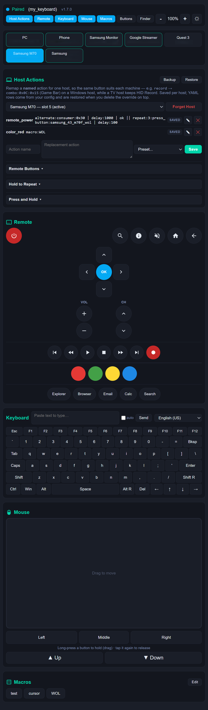
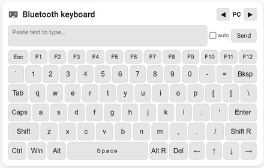

# ESP32 BLE HID Keyboard for ESPHome

This is a custom [ESPHome](https://esphome.io) component that transforms an ESP32 into a Bluetooth Low Energy (BLE) HID Keyboard. This component currently targets **ESP-IDF Bluedroid GATTS** (rather than NimBLE), chosen for the HID behavior and host compatibility validated in this project.

## Features

* **Standard HID Keyboard:** Recognized as a native keyboard by Windows, Android, and iOS. Full HOGP-compliant BLE HID with Device Information and Battery services. Use `passkey_mode: legacy` for Windows (Just Works for Android), `passkey_mode: secure_connections` for iOS.
* **Secure Pairing:** Supports a configurable 6-digit static passkey (PIN) for secure bonding on Windows and iOS. Android uses Just Works pairing (no PIN) due to HID compatibility limitations.
* **Efficient Memory Usage:** Direct API implementation ensures stability even with complex ESPHome configurations.
* **Key Combos:** Send any modifier + key combination using hex keycodes (e.g. Win+R, Ctrl+C).
* **String Typing:** Type any string directly. The active **keyboard layout** (`us`, `uk`, `de`, `be`) controls how each character is mapped to HID keycodes. UK adds `£`, `¬`, `€`; DE adds `ä`, `ö`, `ü`, `ß`, `€`, `§`, `°`; BE adds `é`, `è`, `à`, `ç`, `ù`, `€`, `£`, `²`, `§`, `µ` plus dead-key sequences (`â ê î ô û ä ë ï ö ü` + uppercase) via UTF-8.
* **Keyboard Layouts:** Choose `us` (default), `uk`, `de`, or `be` in YAML, or switch live from the web UI (persisted to NVS). Layout is fully extensible — see [Keyboard layouts](#keyboard-layouts).
* **Press and hold (push-to-talk):** Hold a key down on the host for as long as a physical button is held, instead of sending a tap — per key, and per button per host on the web remote. See [Press and hold](#press-and-hold).
* **Pre-defined Actions:** Built-in helpers for `ctrl_alt_del`, `sleep`, `hibernate` and `shutdown`.
* **Media Keys:** Control volume, playback, mute and more via HID consumer control.
* **Power Button:** Native HID power/sleep signals — no Run dialog, clean OS-level control.
* **Consumer Control:** Send any HID consumer code directly from YAML using `consumer:0xXXXX` syntax.
* **Mouse Control:** Left, right, and middle click, cursor movement, and scroll wheel via HID mouse reports.
* **Custom Text Input:** Send any text typed in Home Assistant directly to the paired host device.
* **RSSI Sensor:** Read the signal strength (dBm) of the connected host on a configurable interval. Supports proximity-based automations via `on_rssi_above` / `on_rssi_below`.
* **Host MAC Sensor:** Expose the Bluetooth address of the connected host, so automations can act on *which* machine is connected. Reports the stable identity address, so it holds even on Android and iOS where the connection address rotates.
* **Bonded Slot Protection:** A host slot belongs to its host until you forget it. A stranger that pairs while a bonded slot is active is refused and its bond removed, instead of quietly taking the slot over.
* **Keyboard LED Feedback:** Expose host-side Num Lock, Caps Lock, and Scroll Lock LED state as ESPHome binary sensors. Updated whenever the host writes a HID output report.

📖 [Keycode Reference](docs/keycodes.md) · [🌐 View Web Page](https://markusg1234.github.io/ESPHome-espidf_ble_keyboard)


## Usage Example

Add the following to your ESPHome YAML configuration:

> **Versioning:** tagged releases are listed on the [Releases page](https://github.com/markusg1234/ESPHome-espidf_ble_keyboard/releases). `ref: main` always tracks the latest code (re-fetched per ESPHome's [`external_components`](https://esphome.io/components/external_components.html) `refresh:` interval, default 1 day). Pin a tag like `ref: v1.0.0` to stay on a fixed release and upgrade only when you change the ref.

```yaml
substitutions:
  device_name: bluetooth-keyboard
  friendly_name: "Bluetooth keyboard"
  wifi_ssid: "***"
  wifi_password: "***"
  api_encryption_key: "***"
  ota_password: "***"

esphome:
  name: ${device_name}
  friendly_name: ${friendly_name}

esp32:
  board: esp32dev   # Tested with esp32dev, esp32-c6-devkitm-1 and ESP32-C3
  framework:
    type: esp-idf
    sdkconfig_options:
      CONFIG_BT_ENABLED: y
      CONFIG_BT_CONTROLLER_ENABLED: y
      CONFIG_BT_BLUEDROID_ENABLED: y
      CONFIG_BT_NIMBLE_ENABLED: n
      CONFIG_BT_BLE_ENABLED: y
      CONFIG_BT_GATTS_ENABLE: y
      CONFIG_BT_BLE_42_FEATURES_SUPPORTED: y
      CONFIG_BT_BLE_50_FEATURES_SUPPORTED: n
      CONFIG_BT_BLE_42_ADV_EN: y
      CONFIG_BT_BLE_42_SCAN_EN: y
      CONFIG_BT_BLE_SMP_ENABLE: y
      CONFIG_BT_ACL_CONNECTIONS: "4"

logger:

api:
  encryption:
    key: ${api_encryption_key}

ota:
  - platform: esphome
    password: ${ota_password}

wifi:
  ssid: ${wifi_ssid}
  password: ${wifi_password}
  power_save_mode: light
  fast_connect: true

external_components:
  - source:
      type: git
      url: https://github.com/markusg1234/ESPHome-espidf_ble_keyboard.git
      ref: main            # or pin a release tag, e.g. v1.0.0
      path: components
    refresh: 0s  
    components: [ espidf_ble_keyboard ]

# Required by `web_control: true` below — it hosts the control page.
web_server:
  port: 80

espidf_ble_keyboard:
  id: my_keyboard
  # Optional: BLE device name shown during pairing (max 29 chars, default: "ESP32 BLE KB")
  device_name: "ESP32 BLE KB"
  # Optional: per-character delay when typing strings in ms (default: 80)
  key_delay_ms: 80
  # Optional: Set a 6-digit pairing code.
  # If omitted, the device will use "Just Works" (no PIN) pairing.
  # Note: Android does not support passkey pairing for BLE HID devices.
  passkey: 123456
  # Optional pairing mode when passkey is set:
  # legacy (default, Windows-friendly) or secure_connections (iOS-required)
  passkey_mode: legacy
  # Optional: enable built-in web control page at http://<device-ip>/ble_keyboard
  # Requires web_server component. No HA cards or services needed.
  web_control: true
  # Optional: number of host slots for multi-host switching (1–10, default: 4)
  host_slots: 4
  # Optional: web mouse sensitivity settings
  mouse_sensitivity: 2.0       # base movement speed (default: 1.0)
  mouse_acceleration: 2.0     # speed-based acceleration factor (default: 0.15)
  mouse_max_speed: 4.0         # max sensitivity cap (default: 4.0)
  scroll_sensitivity: 2.0      # scroll speed multiplier (default: 2.0)
  # Optional: screen geometry for absolute pointer (mouse_abs / mouse_abs_px / mouse_abs_mon)
  screen_width: 1920           # pixel space the host maps onto (default: 1920)
  screen_height: 1080          # for multi-monitor, set to the whole virtual desktop
  # Optional: monitor regions (virtual-desktop pixels) for mouse_abs_mon:<idx>:<x%>:<y%>
  # monitors:
  #   - { name: left,  x: 0,    y: 0, width: 1920, height: 1080 }
  #   - { name: right, x: 1920, y: 0, width: 1920, height: 1080 }
  # Optional: link text entities for custom text input (shows Send button in web UI)
  custom_text_id:
    - custom_text
  # Optional: per-slot passkey, pairing mode, keyboard layout, and action overrides
  hosts:
    - slot: 0
      passkey: 111111
      passkey_mode: legacy
      layout: us           # auto-apply this layout whenever slot 0 becomes active
      actions:
        record: "combo:0x0C:0x15"   # this host is a PC: Record drives Game Bar
    - slot: 1
      passkey: 222222
      passkey_mode: legacy
      layout: uk           # ...and this one for slot 1
    - slot: 2
      passkey_mode: legacy
    - slot: 3
      passkey_mode: legacy

button:

  - platform: espidf_ble_keyboard
    keyboard_id: my_keyboard
    name: "Ctrl + F1"
    action: "combo:0x01:0x3A"

  - platform: espidf_ble_keyboard
    keyboard_id: my_keyboard
    name: "Win + R (Run Dialog)"
    # 0x08 = Windows Key, 0x15 = 'r'
    action: "combo:0x08:0x15"

  - platform: template
    name: "Template Hello"
    on_press:
      - lambda: |-
          id(my_keyboard).send_string("Hello\n");

  - platform: espidf_ble_keyboard
    keyboard_id: my_keyboard
    name: "Type Hello"
    action: "Hello\n"

  - platform: espidf_ble_keyboard
    keyboard_id: my_keyboard
    name: "Ctrl Alt Del"
    action: "ctrl_alt_del"

  - platform: espidf_ble_keyboard
    keyboard_id: my_keyboard
    name: "Sleep PC"
    action: "sleep"

  - platform: espidf_ble_keyboard
    keyboard_id: my_keyboard
    name: "Hibernate PC"
    action: "hibernate"

  - platform: espidf_ble_keyboard
    keyboard_id: my_keyboard
    name: "Shutdown PC"
    action: "shutdown"

  - platform: espidf_ble_keyboard
    keyboard_id: my_keyboard
    name: "Mute"
    action: "mute"

  - platform: espidf_ble_keyboard
    keyboard_id: my_keyboard
    name: "Volume Up"
    action: "volume_up"

  - platform: espidf_ble_keyboard
    keyboard_id: my_keyboard
    name: "Volume Down"
    action: "volume_down"

  - platform: espidf_ble_keyboard
    keyboard_id: my_keyboard
    name: "Play / Pause"
    action: "play_pause"

  - platform: espidf_ble_keyboard
    keyboard_id: my_keyboard
    name: "Open Calculator"
    action: "consumer:0x0192"

  - platform: espidf_ble_keyboard
    keyboard_id: my_keyboard
    name: "Left Click"
    action: "left_click"

  - platform: espidf_ble_keyboard
    keyboard_id: my_keyboard
    name: "Move Mouse Right"
    action: "mouse_move:50:0"

  - platform: espidf_ble_keyboard
    keyboard_id: my_keyboard
    name: "Scroll Down"
    action: "mouse_scroll:-3"

  - platform: espidf_ble_keyboard
    keyboard_id: my_keyboard
    name: "Cursor to Center"
    action: "mouse_abs:50:50"        # exact position, percent of screen

  - platform: espidf_ble_keyboard
    keyboard_id: my_keyboard
    name: "Click Corner & Return"
    action: "mouse_abs_save | mouse_abs:5:5 | left_click | mouse_abs_restore"

  - platform: espidf_ble_keyboard
    keyboard_id: my_keyboard
    name: "Send Custom Text"
    action: "send_custom_text"

  - platform: espidf_ble_keyboard
    keyboard_id: my_keyboard
    name: "Host 0"
    action:
      type: switch_host
      slot: 0

  - platform: espidf_ble_keyboard
    keyboard_id: my_keyboard
    name: "Host 1"
    action:
      type: switch_host
      slot: 1

  - platform: restart
    name: ${friendly_name}

text:
  - platform: template
    name: "Custom Text"
    id: custom_text
    mode: text
    optimistic: true

# Optional: lets the Home Assistant remote card mirror the web UI's
# per-host button hiding. Omit it and the card just shows every button.
text_sensor:
  - platform: espidf_ble_keyboard
    keyboard_id: my_keyboard
    type: hidden_buttons
    name: "Hidden Buttons"

binary_sensor:
  - platform: espidf_ble_keyboard
    keyboard_id: my_keyboard
    name: "BLE Keyboard Paired"

  - platform: espidf_ble_keyboard
    keyboard_id: my_keyboard
    type: caps_lock
    name: "BLE Keyboard Caps Lock"

  - platform: status
    name: ${friendly_name}
```

## Configuration Variables

### `espidf_ble_keyboard`

* **id** (Required, ID): The ID used to link buttons or automations to this keyboard.
* **device_name** (Optional, string): The BLE device name advertised during pairing. Defaults to `ESP32 BLE KB`. Maximum 29 characters.
* **key_delay_ms** (Optional, int): Total delay per character when typing strings, in milliseconds. Split evenly between key-down and key-up. Defaults to `80`. Increase if characters are being dropped on slow BLE connections.
* **max_key_hold_ms** (Optional, int): Safety net for a held key whose release never arrives — a browser tab closed mid-press, or an `on_release` that didn't fire. After this many milliseconds the device releases everything it is holding, including a held mouse button. Defaults to `0` (never auto-release); otherwise 100–600000. See [Press and hold](#press-and-hold).
* **passkey** (Optional, int): A 6-digit static PIN (000000–999999). If set, the device uses static passkey pairing (legacy MITM bond) and requires this PIN during initial pairing.
* **passkey_mode** (Optional, string): Passkey security mode. `legacy` (default) uses legacy MITM bonding — tested and recommended for Windows. `secure_connections` uses LE Secure Connections MITM bonding — required for iOS passkey pairing (legacy mode does not work on iOS). Android does not support passkey pairing with BLE HID keyboards.
* **web_control** (Optional, bool): Enable a built-in web control page with keyboard and mouse UI at `http://<device-ip>/ble_keyboard`. Requires the `web_server` component. Defaults to `false`.
* **api_services** (Optional, bool): Auto-register all documented Home Assistant services (`run_action`, `run_macro`, `send_string`, `send_key`, `send_consumer`, `mouse_move`, `mouse_scroll`, `mouse_click`, `mouse_hold`, `mouse_release`, `mouse_abs`, `switch_host`, `forget_host`) directly from the component — no `api: services:` yaml needed, and the HA cards work out of the box. Requires the `api:` component. Defaults to `false`. **Don't combine with the manual `api: services:` snippets below** — you'd register the same service names twice; delete the manual copies when enabling this. See [Home Assistant services](#home-assistant-services).
* **ha_action** (Optional, bool): Allow the `ha_action:` prefix to fire Home Assistant actions from the device — how a remote key reaches things BLE can't, such as an IR blaster's `remote.send_command`. Requires the `api:` component (`api: homeassistant_services: true` is enabled automatically) and Home Assistant's own per-device permission. Defaults to `false` — the web page is unauthenticated, so this is a deliberate opt-in. See [Calling Home Assistant Actions](#calling-home-assistant-actions).
* **host_slots** (Optional, int): Number of host slots for multi-host switching (1–10). Each slot can store a bonded host. Switch between hosts using buttons, HA services, or the web control page. Defaults to `4`.
* **mouse_sensitivity** (Optional, float): Web mouse base movement multiplier. Defaults to `1.0`. Range: 0.1–10.0.
* **mouse_acceleration** (Optional, float): Web mouse speed-based acceleration factor. Defaults to `0.15`. Range: 0.0–2.0.
* **mouse_max_speed** (Optional, float): Web mouse maximum sensitivity cap. Defaults to `4.0`. Range: 0.5–20.0.
* **scroll_sensitivity** (Optional, float): Web mouse scroll speed multiplier. Defaults to `2.0`. Range: 0.1–10.0.
* **screen_width** / **screen_height** (Optional, int): The pixel space the host maps the absolute pointer's `0..32767` range onto, used by `mouse_abs_px` and `mouse_abs_mon`. For a single screen, set to its resolution; for a spanned multi-monitor setup, set to the whole **virtual desktop** size. Defaults to `1920` / `1080`. Range: 1–32767. See [Absolute mouse positioning](#absolute-mouse-positioning).
* **monitors** (Optional, list): Per-monitor regions (in virtual-desktop pixels) for `mouse_abs_mon:<idx>:<x%>:<y%>`. Each entry has optional `name`, required `x`, `y`, `width`, `height`, and optional `primary` (mark the Windows primary monitor — its top-left is the Windows `0,0` origin that `mouse_goto` homes to, and the web Position Finder needs it to emit correct `mouse_goto` values). See [Absolute mouse positioning](#absolute-mouse-positioning).
* **mouse_goto_scale** (Optional, float): Calibration multiplier for `mouse_goto`'s relative step, to compensate for the host's pointer-speed / DPI scaling — sets **both** axes. Defaults to `1.0`. If the cursor travels about **twice** as far as intended, set `0.5`; tune until a `mouse_goto` lands on target. (Requires "Enhance pointer precision" **off** — acceleration is non-linear and can't be calibrated out.) Range: 0.05–20.0.
* **mouse_goto_scale_x** / **mouse_goto_scale_y** (Optional, float): Per-axis override of `mouse_goto_scale`. X and Y often need **different** values (a host can scale the axes differently), so calibrate each independently. Range: 0.05–20.0. Easiest to dial in live via the web Position Finder, which also saves the values per host. See [Absolute mouse positioning](#absolute-mouse-positioning).
* **custom_text_id** (Optional, ID or list of IDs): Link one or more ESPHome `text` entities for custom text input. Automatically registers a "Send" button in the web UI for each. Use `send_custom_text` or `send_custom_text:N` action to trigger.
* **expose_buttons** (Optional, boolean): List every non-internal ESPHome `button` in your config on the [web control page](#pressing-other-esphome-buttons), so it can reach things BLE can't — Wake-on-LAN, a relay, a restart. Defaults to `true`.
* **hide_buttons** (Optional, ID or list of IDs): Buttons to keep *off* the web page. The page has no authentication, so use this for anything destructive (`factory_reset`, `restart`). Hidden buttons also refuse to run if their action is typed by hand.
* **keyboard_layout** (Optional, string): Default keyboard layout. One of `us` (default), `uk`, `de`, `be`. Controls how `send_string` maps each character to USB HID keycodes — must match the *host's* keyboard layout. Can be overridden at runtime from the web UI (persisted to NVS, survives reboot). See [Keyboard layouts](#keyboard-layouts) below.
* **hosts** (Optional, list): Per-slot passkey and pairing mode overrides. Each entry has:
  * **slot** (Required, int): Host slot number (0–9).
  * **passkey** (Optional, int): 6-digit PIN for this slot (000000–999999). If omitted, the slot uses the global `passkey` setting (or Just Works if no global passkey).
  * **passkey_mode** (Optional, string): `legacy` (default) or `secure_connections`. Overrides the global `passkey_mode` for this slot.

### `button` (Platform: `espidf_ble_keyboard`)

* **keyboard_id** (Required, ID): The ID of the `espidf_ble_keyboard` component.
* **action** (Required, string or mapping): The action to perform when the button is pressed. Accepts either a string or a dict with `type` key (see below).

### `binary_sensor` (Platform: `espidf_ble_keyboard`)

The binary_sensor platform supports four types via the `type` key:

#### Paired Sensor (default)

Reports whether the keyboard has completed BLE pairing with a host on the current connection.

* **keyboard_id** (Required, ID): The ID of the `espidf_ble_keyboard` component.
* **type** (Optional, string): `paired` (default).
* **name** (Optional, string): Friendly entity name shown in Home Assistant.

State behavior:

* **ON** = a `GAP: Pairing Successful` event occurred on the current connection.
* **OFF** = keyboard is disconnected (including host-side unpair) or not yet paired in this session.

#### LED State Sensors (Num Lock / Caps Lock / Scroll Lock)

Expose the host-side keyboard LED state, as reported by the connected host via the HID output report. Updates within one loop cycle of the host changing the lock state.

* **keyboard_id** (Required, ID): The ID of the `espidf_ble_keyboard` component.
* **type** (Required, string): One of `num_lock`, `caps_lock`, `scroll_lock`.
* **name** (Optional, string): Friendly entity name shown in Home Assistant.

State behavior:

* **ON** = the corresponding lock LED is currently lit on the host.
* **OFF** = the lock is off, or no host has sent an LED report yet.

```yaml
binary_sensor:
  - platform: espidf_ble_keyboard
    keyboard_id: my_keyboard
    type: num_lock
    name: "BLE Keyboard Num Lock"

  - platform: espidf_ble_keyboard
    keyboard_id: my_keyboard
    type: caps_lock
    name: "BLE Keyboard Caps Lock"

  - platform: espidf_ble_keyboard
    keyboard_id: my_keyboard
    type: scroll_lock
    name: "BLE Keyboard Scroll Lock"
```

Note: LED state reflects what the *host* thinks the lock state is. After re-pairing or host switching, sensors may briefly show stale values until the host sends a fresh LED report.

### `sensor` (Platform: `espidf_ble_keyboard`)

The sensor platform supports two types via the `type` key:

#### RSSI Sensor (default)

Exposes the RSSI (signal strength) of the currently connected host as an ESPHome sensor entity.

* **keyboard_id** (Required, ID): The ID of the `espidf_ble_keyboard` component.
* **type** (Optional, string): `rssi` (default).
* **name** (Optional, string): Friendly entity name shown in Home Assistant.
* **update_interval** (Optional, duration): How often to read RSSI from the connected host. Default: `10s`.

State behavior:

* Publishes the RSSI value in **dBm** (e.g. `-65`) while a host is connected.
* Publishes **unavailable** when the host disconnects.

```yaml
sensor:
  - platform: espidf_ble_keyboard
    keyboard_id: my_keyboard
    name: "BLE Host RSSI"
    update_interval: 15s
```

#### Active Host Sensor

Publishes the currently active host slot number (0-based). Updates instantly when the host is switched from the webserver, HA card, or YAML automation.

Optional, and only relevant if you use the [card host switchers](#host-switcher-on-the-cards). They already stay in sync by polling the device every 30 seconds; this sensor makes that instant, and becomes the *only* sync path when the cards can't reach the device directly (Home Assistant on HTTPS).

* **keyboard_id** (Required, ID): The ID of the `espidf_ble_keyboard` component.
* **type** (Required, string): `active_host`.
* **name** (Optional, string): Friendly entity name shown in Home Assistant.

```yaml
sensor:
  - platform: espidf_ble_keyboard
    keyboard_id: my_keyboard
    type: active_host
    name: "BLE Keyboard Active Host"
```

The cards auto-detect this entity by name pattern (`sensor.*_active_host`). If auto-detection fails, set `active_host_entity` in the card config:

```yaml
type: custom:ble-keyboard-card
device: bluetooth_keyboard
host_slots: 4
active_host_entity: sensor.bluetooth_keyboard_active_host
```

#### Proximity Automations

Use `on_rssi_above` and `on_rssi_below` on the main `espidf_ble_keyboard` component to trigger actions based on signal strength. Both fire on every RSSI sample that crosses the threshold — add your own debounce logic (e.g. a `script` or `globals` flag) if needed.

| Key | Description |
|---|---|
| `threshold` | RSSI value in dBm (−127 to 0). `on_rssi_above` fires when RSSI > threshold. `on_rssi_below` fires when RSSI < threshold. |

The automation receives a single `rssi` variable (int, dBm) you can use in lambdas.

```yaml
espidf_ble_keyboard:
  id: my_keyboard
  on_rssi_above:
    threshold: -65      # fires when host is close (strong signal)
    then:
      - logger.log:
          format: "Host nearby (RSSI %d dBm)"
          args: [rssi]
  on_rssi_below:
    threshold: -90      # fires when host moves far away (weak signal)
    then:
      - logger.log:
          format: "Host far away (RSSI %d dBm)"
          args: [rssi]
```

> **Tip:** Typical indoor RSSI values range from around −40 dBm (very close) to −90 dBm (far/weak). A threshold of −70 to −75 is a reasonable starting point for proximity detection.

#### Action Types

| Action | Description |
|---|---|
| `"Hello\n"` | Type a string. Use `\n` for Enter. Printable ASCII is supported on all layouts; non-ASCII (e.g. `£ ¬ €` on UK) is supported via UTF-8 when a layout exposes it. Characters with no layout mapping are silently skipped. |
| `"combo:0x08:0x15"` | Send a key combination. Format: `combo:<modifier_hex>:<keycode_hex>`. Use `0x00` as modifier for no modifier key. See [Keycode Reference](docs/keycodes.md). |
| `"combo:0x00:0x04"` | Send a plain keypress with no modifier. `0x04` = A, `0x05` = B ... `0x1D` = Z. |
| `"consumer:0x0192"` | Send any HID consumer control code. Format: `consumer:<usage_hex>`. See [Keycode Reference](docs/keycodes.md) for full list. |
| `"ctrl_alt_del"` | Send the Ctrl+Alt+Del secure login sequence. |
| `"sleep"` | HID System Sleep signal — clean OS-level sleep. |
| `"hibernate"` | Hibernate the PC — saves to disk, full power off. Requires `powercfg /hibernate on`. |
| `"shutdown"` | HID System Power Down signal — clean OS-level shutdown. |
| `"power"` | HID power button — triggers Windows power button action. |
| `"mute"` | Toggle mute. |
| `"volume_up"` | Volume up. |
| `"volume_down"` | Volume down. |
| `"play_pause"` | Play / pause media. |
| `"next_track"` | Skip to next track. |
| `"prev_track"` | Previous track. |
| `"stop"` | Stop media playback. |
| `"record"` | Start / stop recording (HID Record, `0x00B2`). Works on TV / DVR hosts; **Windows ignores it** — remap it per host with [`actions:`](#host-actions-per-host-overrides), e.g. `"combo:0x0C:0x15"` for Game Bar. |
| `"rewind"` | Rewind (`0x00B4`). |
| `"fast_forward"` | Fast forward (`0x00B3`). |
| `"remote_power"` | Remote Power key — HID consumer Power (`0x0030`). Distinct from `"power"` above, which is a System Power Down report. |
| `"up"` / `"down"` / `"left"` / `"right"` | D-pad navigation — HID Menu Up / Down / Left / Right (`0x0042`–`0x0045`). |
| `"ok"` | D-pad select — keyboard **Enter** (`0x28`). Enter is accepted by far more hosts than HID Menu Pick; if a host needs Menu Pick instead, override it per host with `"consumer:0x0041"`. |
| `"home"` | AC Home (`0x0223`). |
| `"back"` | AC Back (`0x0224`). |
| `"search"` | AC Search (`0x0221`). |
| `"info"` | AC More Info / Guide (`0x0209`). |
| `"channel_up"` / `"channel_down"` | Channel surf — Page Up / Page Down keypress. |
| `"color_red"` / `"color_green"` / `"color_yellow"` / `"color_blue"` | Coloured remote keys — F1–F4, as most media apps expect. |
| `"app_explorer"` / `"app_browser"` / `"app_email"` / `"app_calc"` | App launch keys (`0x0194`, `0x0223`, `0x018A`, `0x0192`). |
| `"menu"` / `"exit"` | Menu (`0x0040`) and Menu Escape (`0x0046`) — the hamburger and back-out keys a set-top remote has. |
| `"guide"` / `"tv"` | Programme Guide (`0x008D`) and Media Select TV (`0x0089`). |
| `"voice"` | Voice Command (`0x00CF`) — the microphone key. |
| `"captions"` | Closed Caption (`0x0061`) — subtitles on/off. |
| `"num0"` … `"num9"` | The keypad, as plain keyboard digits — direct channel entry on a TV, typing a number on a PC. |
| `"spare1"` … `"spare8"` | Send **nothing** on their own. They exist as names to hang a [per-host override](#host-actions-per-host-overrides) on, for remote keys with no standard HID usage worth guessing — an app launcher, a set-top box's Input, a vendor's own menu. Pressing an unmapped one logs a hint and does nothing. |

> The six keys above are standard Consumer Page usages, but that page is patchily implemented — a host that ignores one leaves the button dead. That is what overrides are for, and it is the same reason `ok` sends Enter rather than Menu Pick.
| `"left_click"` | Mouse left click. |
| `"right_click"` | Mouse right click. |
| `"middle_click"` | Mouse middle click. |
| `"mouse_click:0x01"` | Mouse click with button mask. `0x01` = left, `0x02` = right, `0x04` = middle. Combine for simultaneous buttons. |
| `"left_click_hold"` | Press **and hold** the left button until `mouse_release`. Moving, scrolling or `mouse_goto` while held performs a drag. |
| `"right_click_hold"` | Press and hold the right button. |
| `"middle_click_hold"` | Press and hold the middle button. |
| `"mouse_hold:0x01"` | Press and hold with a button mask (same masks as `mouse_click`). |
| `"mouse_release"` | Release all held mouse buttons. A normal click also releases them. |
| `"key_hold:0x00:0x3A"` | Press **and hold** a key until `release` — the host sees it held down, not tapped. Format matches `combo:`. A keycode of `0x00` holds the modifier alone (e.g. `key_hold:0x01:0x00` holds Ctrl). See [Press and hold](#press-and-hold). |
| `"consumer_hold:0x00E9"` | Hold a consumer usage. Only one can be held at a time — the report has a single usage field. |
| `"hold:<action>"` | Hold whatever `<action>` is: `combo:`, `consumer:`, a mouse click, or a named action including one remapped by [`actions:`](#host-actions-per-host-overrides). Anything that can't be held (text, macros, `switch_host:`) runs once instead. |
| `"release"` | Release everything held — keys, consumer usage and mouse buttons. `key_release` is an alias. |
| `"mouse_move:<x>:<y>"` | Move mouse cursor. Values -127 to 127 (relative, pixels). |
| `"mouse_scroll:<wheel>"` | Scroll mouse wheel. Positive = up, negative = down (-127 to 127). |
| `"mouse_abs:<x%>:<y%>"` | Move cursor to an **exact** position, percent of screen (0–100, decimals allowed). E.g. `mouse_abs:50:50` = center. See [Absolute mouse positioning](#absolute-mouse-positioning). |
| `"mouse_abs_px:<x>:<y>"` | Move cursor to an exact position in **pixels** (uses `screen_width`/`screen_height`). |
| `"mouse_abs_mon:<idx>:<x%>:<y%>"` | Move cursor to a percent within declared `monitors[idx]` (multi-monitor). |
| `"mouse_abs_save"` | Remember the current absolute position (the one this device last set). |
| `"mouse_abs_restore"` | Jump back to the last `mouse_abs_save` position. |
| `"mouse_goto:<x>:<y>"` | Move to a **Windows virtual-desktop pixel** across **all monitors** (homes the absolute pointer to the desktop origin, then steps relatively). X/Y are Windows coordinates (primary monitor top-left = 0,0; screens left of it are negative). Use this when the absolute pointer is confined to the primary monitor. Needs "Enhance pointer precision" **off** and a fixed pointer-speed slider position (the per-axis calibration is tied to it) for pixel accuracy. |
| `"switch_host:N"` | Switch to host slot N (0–9). Reconnects to stored host or advertises for new pairing. |
| `"forget_host:N"` | Remove BLE bond for host slot N (0–9) and clear the slot. |
| `"string:hello"` | Explicit text typing — useful in multi-step macros to distinguish text from action names. |
| `"delay:N"` | Pause for N milliseconds (max 10000). Used between steps in multi-step macros. |
| `"repeat:N:<action>"` | Run `<action>` N times (max 1000). Put it at the start of a macro to repeat the whole sequence, e.g. `repeat:3:combo:0:40 \| delay:200`. |
| `"send_custom_text"` | Send the first linked text entity's content. Requires `custom_text_id` in config. |
| `"send_custom_text:N"` | Send the Nth linked text entity (0-based). E.g. `send_custom_text:1` for the second. |

**Lambda helpers** (for use in YAML automations):

| Method | Description |
|--------|-------------|
| `execute_action("action_string")` | Run any action string from a lambda. Works with all action types above. Supports multi-step with `\|`. |
| `execute_macro(index)` | Run a web-defined macro by index (0-based, shown as [0], [1] in web UI). Returns `false` if index is out of range. |

---

### `text_sensor` (Platform: `espidf_ble_keyboard`)

Optional. Four types are available.

* **keyboard_id** (Required, ID): The ID of the `espidf_ble_keyboard` component.
* **type** (Optional, string): `hidden_buttons` (default), `host_mac`, `hold_buttons`, `repeat_buttons` or `remote_style`.
* **name** (Optional, string): Friendly entity name shown in Home Assistant.

#### Hidden buttons

Publishes the active host's hidden remote buttons so the [Media Remote Card](#media-remote-card-for-home-assistant) can mirror the web remote's [per-host button removal](#removing-remote-buttons-per-host). Without it the card simply shows every button; the web remote does not need it either way.

```yaml
text_sensor:
  - platform: espidf_ble_keyboard
    keyboard_id: my_keyboard
    type: hidden_buttons
    name: "Hidden Buttons"
```

The state is a comma-separated list of action names — `record,app_calc,color_red` — or empty when the active host hides nothing. It republishes when you save in the Host Actions card and whenever the host is switched.

#### Press-and-hold buttons

Publishes the active host's [Press and hold](#press-and-hold-per-host) list, so the Media Remote Card holds those buttons down instead of tapping them. **Without it the card cannot do push-to-talk at all** — it has no other way to learn the per-host choice, because a dashboard served over https can't fetch the device's REST API.

```yaml
text_sensor:
  - platform: espidf_ble_keyboard
    keyboard_id: my_keyboard
    type: hold_buttons
    name: "Hold Buttons"
```

Same format as the hidden list: `volume_up,ok`, or empty when nothing holds on this host.

#### Hold-to-repeat config

Publishes the active host's [Hold to repeat](#hold-to-repeat-per-host) settings, so the card repeats the same buttons at the same speed as the web remote. **Without it the card falls back to repeating volume and channel only**, ignoring whatever Host Actions says.

```yaml
text_sensor:
  - platform: espidf_ble_keyboard
    keyboard_id: my_keyboard
    type: repeat_buttons
    name: "Repeat Buttons"
```

The state is `<delay>,<rate>,name,name` — `400,180,volume_up,volume_down` — or empty when this host was never configured, which tells the card to keep its own defaults. A host configured to repeat nothing publishes just `400,180`.

#### Host MAC

Publishes the Bluetooth address of the connected host, so an automation can tell *which* machine it is talking to. The [active host sensor](#active-host-sensor) only reports the slot number, which is not the same thing — see [protecting a bonded host slot](#protecting-a-bonded-host-slot).

```yaml
text_sensor:
  - platform: espidf_ble_keyboard
    keyboard_id: my_keyboard
    type: host_mac
    name: "Host MAC"
```

The state is `AA:BB:CC:DD:EE:FF`, or empty while nothing is connected. Use it to gate an automation on a specific machine:

```yaml
espidf_ble_keyboard:
  id: my_keyboard
  on_rssi_above:
    threshold: -65
    then:
      - if:
          condition:
            lambda: 'return id(host_mac).state == "04:CB:01:07:D2:24";'
          then:
            - logger.log: "My phone is nearby"
```

Where the host supplied an identity key when pairing, this is its **identity address** rather than the address it happened to connect with. That matters on Android and iOS, which connect using a private address that rotates roughly every 15 minutes: the identity address does not rotate, so a comparison like the one above keeps working. Hosts with a fixed address — Windows PCs, most TVs — report the same value either way.

The web remote's host buttons and the cards' MAC display show this same identity address, so every place an address appears agrees with the sensor and with what the phone reports for itself. A backup still records the address the host connected with, since that is what restoring a slot needs.

Each slot learns its host's identity the next time that host connects, and remembers it from then on. A host paired before this existed keeps showing its old address until it next connects — you do not need to pair it again. This matters because the identity can only be looked up while the host is connected: once a phone has rotated away from the address its slot was recorded under, nothing can map that slot back on its own.

The value is only as stable as the bond. Unpair and pair again and a phone may present a different identity, so re-check the sensor after re-pairing rather than assuming the old value still holds. Treat this as identification, not authentication — it tells one device from another, but it is not proof against a device that deliberately imitates one.

> **These are diagnostic entities.** They carry machine-readable state for the cards rather than anything to read yourself, so they default to `entity_category: diagnostic` — Home Assistant files them under **Diagnostic** on the device page and leaves them out of auto-generated dashboards, instead of listing a long comma-separated repeat config across the integration screen. Set `entity_category:` on the sensor to promote one back to the main list. Add only the sensors your cards actually use; each is optional.

> ESPHome text sensors appear in Home Assistant under the **`sensor.`** domain, not `text_sensor.`. With the YAML above the entities are `sensor.<device>_hidden_buttons`, `sensor.<device>_hold_buttons`, `sensor.<device>_repeat_buttons`, `sensor.<device>_remote_style` and `sensor.<device>_host_mac`. Those names are what the cards auto-detect; if you give one a different `name`, set the matching `hidden_entity:` / `hold_entity:` / `repeat_entity:` on the card.

---

## Dict Action Format

Instead of a string, `action` also accepts a mapping with a `type` key. This can be more readable for complex actions:

```yaml
# Combo — modifier + key
action:
  type: combo
  modifier: 0x01   # 0x00 = none, 0x01 = Ctrl, 0x02 = Shift, 0x04 = Alt, 0x08 = Win
  key: 0x04        # 0x04 = A ... 0x1D = Z, see Keycode Reference

# Plain keypress — no modifier
action:
  type: combo
  modifier: 0x00
  key: 0x04        # Just 'A'

# Consumer control
action:
  type: consumer
  code: 0x0192     # Open Calculator

# Mouse click
action:
  type: mouse_click
  buttons: 0x01    # 0x01 = left, 0x02 = right, 0x04 = middle

# Mouse move
action:
  type: mouse_move
  x: 50            # move 50px right
  y: -20           # move 20px up

# Mouse scroll
action:
  type: mouse_scroll
  wheel: 3         # scroll up 3 notches (negative = down)

# Absolute move — exact position, percent of screen
action:
  type: mouse_abs
  x: 50            # 50% across
  y: 50            # 50% down (center)

# Absolute move — exact pixels (uses screen_width / screen_height)
action:
  type: mouse_abs_px
  x: 1280
  y: 720

# Absolute move — percent within a declared monitor
action:
  type: mouse_abs_mon
  monitor: 1       # index into the `monitors:` list
  x: 50
  y: 50

# Switch host
action:
  type: switch_host
  slot: 1             # switch to host slot 1

# Forget host
action:
  type: forget_host
  slot: 2             # remove bond for host slot 2
```

Both formats are equivalent — the dict format is converted to the string format at compile time so there is no runtime difference.

---

## Home Assistant Services

Set `api_services: true` and the component registers every documented Home Assistant service by itself — no `api: services:` yaml to paste, and all three HA cards (mouse, keyboard, media remote) work out of the box:

```yaml
api:
  encryption:
    key: !secret api_key

espidf_ble_keyboard:
  id: my_keyboard
  api_services: true
```

Services appear in HA under **Developer Tools → Actions** as `esphome.<device_name>_<service>`:

| Service | Variables | Description |
|---------|-----------|-------------|
| `run_action` | `action: string` | Run any [action string](#usage-example) — single or multi-step with `\|`. Reaches everything below plus every named action. |
| `run_macro` | `index: int` | Run a stored web macro by its index ([0], [1], … in the web UI). |
| `send_string` | `keys: string` | Type text (used by the keyboard and remote cards). |
| `send_key` | `modifier: int`, `keycode: int` | Send a key combination (HID modifier + keycode). |
| `send_consumer` | `code: int` | Send a HID consumer control code. |
| `mouse_move` | `x: int`, `y: int` | Relative cursor move (−127…127). |
| `mouse_scroll` | `amount: int` | Scroll wheel (−127…127). |
| `mouse_click` | `btn: int` | Click with button mask (1 = left, 2 = right, 4 = middle). |
| `mouse_hold` | `btn: int` | Press and hold for dragging — release with `mouse_release`. |
| `mouse_release` | — | Release all held mouse buttons. |
| `mouse_abs` | `x: float`, `y: float` | Move cursor to an exact position, percent of screen (0–100). |
| `switch_host` | `slot: int` | Switch to host slot N (0–9). |
| `forget_host` | `slot: int` | Remove the bond for host slot N (0–9). |

Requirements and notes:

* Requires the `api:` component (config validation fails with a clear error without it). The component automatically enables `api: custom_services: true` for you (needed by ESPHome 2025.11+ for dynamically registered services).
* **Don't combine with manual `api: services:` definitions of the same names** — if you previously pasted the per-card snippets below, delete them when enabling `api_services: true`, or the service names collide.
* The manual snippets in the card sections below remain fully supported as the "custom" path — use them if you want different service names, extra validation, or only a subset.

---

## Multi-Host Switching

The keyboard supports up to 10 bonded hosts and can switch between them on the fly — like commercial keyboards with a host-switch button. Each host slot stores the bonded device address in NVS (persistent across reboots).

### How It Works

1. **Pair your first host** — it is automatically saved to slot 0.
2. **Switch to an empty slot** (e.g. slot 1) — the keyboard disconnects and starts advertising. Pair a new host; it is saved to that slot.
3. **Switch back** — the keyboard disconnects from the current host and uses directed advertising to reconnect to the stored host. The target host reconnects automatically (no re-pairing needed).

Each host slot uses a unique BLE address, so other bonded hosts won't interfere during pairing.

Switching takes 1–3 seconds depending on the host OS.

### YAML Configuration

```yaml
espidf_ble_keyboard:
  id: my_keyboard
  host_slots: 4          # 1–10, default: 4

button:
  - platform: espidf_ble_keyboard
    keyboard_id: my_keyboard
    name: "Host 0"
    action:
      type: switch_host
      slot: 0

  - platform: espidf_ble_keyboard
    keyboard_id: my_keyboard
    name: "Host 1"
    action:
      type: switch_host
      slot: 1

  - platform: espidf_ble_keyboard
    keyboard_id: my_keyboard
    name: "Host 2"
    action:
      type: switch_host
      slot: 2

  - platform: espidf_ble_keyboard
    keyboard_id: my_keyboard
    name: "Host 3"
    action:
      type: switch_host
      slot: 3

  - platform: espidf_ble_keyboard
    keyboard_id: my_keyboard
    name: "Forget Host 0"
    action:
      type: forget_host
      slot: 0
  - platform: espidf_ble_keyboard
    keyboard_id: my_keyboard
    name: "Forget Host 1"
    action:
      type: forget_host
      slot: 1
  - platform: espidf_ble_keyboard
    keyboard_id: my_keyboard
    name: "Forget Host 2"
    action:
      type: forget_host
      slot: 2
  - platform: espidf_ble_keyboard
    keyboard_id: my_keyboard
    name: "Forget Host 3"
    action:
      type: forget_host
      slot: 3            
```

String action format is also supported: `"switch_host:0"`, `"forget_host:2"`.

### Protecting a Bonded Host Slot

Once a slot is bonded to a host, only that host can hold it. A different device that pairs while that slot is active is turned away: its bond is removed, it is disconnected, and the slot keeps its original host. To hand a slot to a different machine, forget it first.

This matters most on Android, which [cannot use a passkey with a BLE HID keyboard](#pairing-with-android) — pairing is unauthenticated, so anyone who scans for Bluetooth devices can attempt to pair. Without this, whoever paired last took over the active slot, and any automation keyed on the [active host sensor](#active-host-sensor) would have been none the wiser, because the slot number does not change when the device behind it does.

A few things worth knowing:

* **The refusal happens just after pairing, not instead of it.** The other device briefly shows as paired on its own screen before being dropped. That is expected — it is only at that point that the keyboard learns who connected. It ends up with no usable bond and cannot reconnect.
* **Your own host is not locked out.** Hosts are matched by identity, so a phone returning on a rotated address, or re-pairing after you unpaired it, is recognised as the slot's owner and let straight back in. No forget needed.
* **A slot with no live bond is still free to take.** After restoring a backup, or after a stale bond is cleared, the slot holds an address but no pairing keys — it accepts a new host as before, since refusing would leave no way back in.
* **Rejections are logged.** A warning naming the refused address and the slot it tried to take is the only notification you get, so check the logs if a device unexpectedly will not pair.

### Host Switching from Home Assistant

Easiest: set `api_services: true` on the component — it auto-registers `switch_host` and `forget_host` (see [Home Assistant services](#home-assistant-services)). To define them manually instead:

```yaml
api:
  services:
    - service: switch_host
      variables:
        slot: int
      then:
        - lambda: |-
            id(my_keyboard).switch_host(slot);
    - service: forget_host
      variables:
        slot: int
      then:
        - lambda: |-
            id(my_keyboard).forget_host(slot);
```

### Web Control

When `web_control: true` is enabled, a full control page is available at `http://<device-ip>/ble_keyboard` with **keyboard, mouse, Position Finder, remote, buttons, macro, and host action** sections. Section toggle buttons in the toolbar let you show/hide (and reorder) each section. When `host_slots` > 1, a host bar appears below the toolbar showing all slots. Click a slot to switch. The active slot is highlighted. Occupied slots show the stored Bluetooth address. The **Position Finder** (locked by default; click **Edit** to use) sends the cursor to an exact spot and calibrates `mouse_goto` per host — see [Absolute mouse positioning](#absolute-mouse-positioning).



### Host Actions (Per-Host Overrides)

Paired hosts rarely agree on what a key should do. The clearest example is **Record**: the `record` action sends HID consumer usage `0x00B2`, which an Android TV box or DVR handles natively — but **Windows ignores it completely**. Windows routes Play/Pause/Next/Prev through SystemMediaTransportControls (which is why media keys work on a YouTube tab) and volume straight to the audio endpoint, but nothing subscribes to Record. On a PC the working route is a key combo: Game Bar's `Win+Alt+R`, or whatever global hotkey you bind in OBS or Audacity.

Rather than pick one behaviour, remap the action **per host**. Add an `actions:` mapping to any entry in the `hosts:` list — the same Record button then does the right thing on whichever host is active:

```yaml
espidf_ble_keyboard:
  id: my_keyboard
  host_slots: 4
  hosts:
    - slot: 0                            # Windows PC
      actions:
        record: "combo:0x0C:0x15"        # Win+Alt+R — Game Bar start/stop
    - slot: 1                            # Android TV — no actions:, keeps HID 0x00B2
```

The replacement can be any action string, including a multi-step chain: `record: "combo:0x0C:0x15 | delay:500 | string:recording"`.

**A second real case — the OK button.** Hosts disagree about how "select" arrives. `ok` sends keyboard Enter, which most hosts accept, but some set-top boxes want HID Menu Pick instead, and a few Samsung/Tizen inputs respond to Space. The symptom is distinctive: the D-pad arrows navigate perfectly while OK does nothing, because the arrows and OK use different HID pages. Fix it on the host that needs it:

```yaml
    - slot: 2                            # set-top box that wants Menu Pick
      actions:
        ok: "consumer:0x0041"            # or "combo:0:44" for Space
```

**Rules and limits:**

- **Every button on both remotes is remappable.** All of them — D-pad, Power, Channel, Rewind/FF, the colour keys and app launchers — fire named actions for exactly this reason. The one exception is the number pad, which types digits rather than sending a fixed HID code.
- Only **named** actions can be overridden (`record`, `up`, `channel_up`, `play_pause`, …) — the ones in the [Action Types](#action-types) table with no `:` parameter. Parametric forms like `combo:` and `consumer:` are dispatched before the override lookup, so they always mean exactly what they say. That's deliberate: `consumer:0x00B5` must never silently become something else.
- Resolution order is **web-UI override → YAML `actions:` → built-in behaviour**.
- Max 8 overrides per host slot. Names are max 31 characters and may not contain `=`, `|`, or whitespace; replacements are max 255 characters.
- An override body is executed with overrides disabled, so `record: "record"` safely runs the built-in Record rather than looping.
- Overrides apply everywhere the named action is used — remote buttons, macros, YAML `button` actions, and the `run_action` HA service — not just the remote.

**Reusing a macro:** picking a macro from the Host Actions preset dropdown inserts `macro:<name>` — a **reference**, not a copy. Edit the macro afterwards and every override pointing at it follows automatically. Because the link is by name, renaming a macro breaks it: the override then logs "no macro named …" and does nothing rather than silently running something else. Macro names must be unique and cannot contain `|`.

A dangling reference is flagged: any override row pointing at a macro that no longer exists gets a red **⚠** whose tooltip names the missing macro. It updates live, so renaming or deleting a macro immediately marks the rows that referred to it.

> Overrides created before v1.5.0 hold a *copy* of the macro's text and keep working unchanged — they just don't track edits. Re-pick the macro from the dropdown to turn one into a reference.

**Editing without a reflash:** the web UI has a **Host Actions** card. Pick a host slot, then add or edit overrides for it; they persist to NVS and win over the YAML value. The action-name box offers every overridable name as you type, and the replacement box has the same preset dropdown as the macro editor, so neither has to be typed from memory. Rows tagged `YAML` come from your config and are read-only — set an override of the same name to shadow one, and delete that override to fall back. You can edit a slot other than the one currently active.


**Forget Host** sits next to the slot picker and removes the BLE bond for whichever slot the picker shows — including one that isn't the active host. It takes two taps: the first turns it red and reads `Confirm?`, the second does it, and it disarms itself after three seconds or if you change slot.

The same card also hosts the [Backup & Restore](#backup-and-restore) buttons, the [Remote Buttons](#removing-remote-buttons-per-host) hiding panel, the [Hold to Repeat](#hold-to-repeat-per-host) panel and the [Press and Hold](#press-and-hold-per-host) panel.

### Removing Remote Buttons Per Host

Most hosts need only a fraction of the remote. A TV box has no use for Explorer/Calc/Email, a PC has no use for the coloured DVB keys. Open **Remote Buttons** in the Host Actions card, pick the host, and untick whatever that host doesn't need — the buttons disappear from the remote for that host only.

This is **presentation only**. The action still runs from macros, YAML `button` actions and the `run_action` service, so a macro calling `record` still records even with the Record button hidden. Removing a button declutters the remote; it does not disable anything.

The number pad on the Home Assistant card is the one thing not listed, since its digits type characters rather than firing a named action. Note also that hiding `search` removes both the magnifier and the app row's Search button, because both fire the same action.

Hidden sets are stored per host on the device (max 96 buttons per slot) and are included in [Backup and restore](#backup-and-restore).

**Making the Home Assistant card follow too** is optional and needs one extra entity — the card can't read the device's HTTP API, so the list travels through Home Assistant:

```yaml
text_sensor:
  - platform: espidf_ble_keyboard
    keyboard_id: my_keyboard
    type: hidden_buttons
    name: "Hidden Buttons"
```

The card picks up `sensor.<device>_hidden_buttons` automatically (override with `hidden_entity:` on the card) and hides the same buttons, following host switches live. Without the text sensor the card simply shows everything.

> Home Assistant caps entity states at 255 characters. Hiding nearly every button on a host exceeds that, so the device truncates the published list at a whole-name boundary and logs a warning — a couple of buttons would stay visible on the card, though the web remote is unaffected. Normal-sized sets are nowhere near the limit.

### Hold to Repeat Per Host

Holding a button on the **web remote** makes it fire again and again, the way a real remote ramps the volume or scrolls a menu. A quick tap still sends exactly one press.

Out of the box the D-pad, Volume, Channel, Rewind and Fast Forward repeat; everything else fires once. Open **Hold to Repeat** in the Host Actions card to change that per host — tick the buttons that should repeat, set how long a button must be held before it starts (**Start after**, default 400 ms) and how fast it repeats after that (**Repeat every**, default 180 ms). **Reset** returns the host to the defaults above.

Different hosts want different answers: a TV wants a fast volume ramp, while a PC may want only the D-pad repeating and volume left alone so a long press can't run away with the mixer.

| | Range | Default |
|---|---|---|
| Start after | 100–2000 ms | 400 ms |
| Repeat every | 50–2000 ms | 180 ms |

Values outside those ranges are clamped rather than rejected. The 50 ms floor is not arbitrary — the device drops an identical press that arrives within 30 ms of the last one (the duplicate guard that stops Home Assistant's double-delivered service calls from firing twice), so a faster repeat would silently lose events.

Each repeat is a normal press, so per-host overrides apply to it. One consequence worth knowing: if a button is overridden to something that already loops, such as `repeat:3:volume_up`, holding it multiplies the two.

Settings are stored per host on the device (max 96 buttons per slot), not in the browser, so they follow the host rather than the phone that set them, and they are included in [Backup and restore](#backup-and-restore). The Home Assistant [Media Remote Card](#media-remote-card-for-home-assistant) follows the same settings if you add the [`repeat_buttons` text sensor](#hold-to-repeat-config); without it that card repeats volume and channel only.

A button set to **Press and Hold** below cannot also repeat: holding and repeating are the same gesture, so each panel greys out what the other has taken.

### Press and Hold Per Host

Open **Press and Hold** in the Host Actions card and tick the buttons that should stay **held down** on the host for as long as you hold them on the web remote, instead of sending a tap — what push-to-talk needs. Stored per host slot (max 96 buttons), so the PC running the voice app can hold while a TV slot keeps tapping, and included in [Backup and restore](#backup-and-restore).

Nothing holds by default. The Home Assistant [Media Remote Card](#media-remote-card-for-home-assistant) honours the same list once the [`hold_buttons` text sensor](#press-and-hold-buttons) is added — it is the only way that card can learn the choice. See [Press and hold](#press-and-hold) for the physical-button equivalent, the action strings, and `max_key_hold_ms`.

### Remote Style Per Host

> **Unreleased — `main` only.** Not in **v1.7.0 and earlier**, where the web remote had one fixed layout for every host.

The web remote can be drawn in a different **style** per host, so switching to a media box brings up a compact remote shaped for it and switching back to the PC brings back the full one. Open **Remote Style** in the Host Actions card, pick the host, and step through the styles with **−** and **+**. Each press saves straight away, and changing the active host's style redraws the remote as you go — so the quickest way to find the one you want is to press **+** until it looks right. The list wraps, so you can reach the far end from either direction.

| Style | What it shows |
|---|---|
| **Full remote** | Everything, exactly as before styles existed. The default for every host. |
| **Style 1** | Slab: power, search, D-pad, back/home/menu, transport, volume, channel and an app row. |
| **Style 2** | Power, D-pad, back/home/play, volume and channel rockers, mute. Suits a television. |
| **Style 3** | Compact strip: power, mute, volume and the full transport row. Good for a headless box. |
| **Style 4** | The full set-top shape: number pad, colour keys, nav ring, back/home/TV, one-piece VOL·mute·CH rockers and four app pills. Dark body. |
| **Style 5** | Style 4's layout on a pale body — the only light style, and easier to read on a bright screen. |

Styles 4 and 5 take their key arrangement from [HA-Firemote](https://github.com/PRProd/HA-Firemote) (GPL-3.0). The buttons, icons and renderer are this project's own.

**Light and dark mode.** A style's colours are its own and do **not** follow the page's light/dark toggle — a black remote stays black on a light page, which is the point of it looking like the real thing. Only **Full remote** follows the theme, because it sets no colours at all and everything falls through to the page palette. That is why Styles 4 and 5 exist as a pair: they are the same remote, and you pick the one that suits your theme. The same applies to a style you write — set a colour and you own it in both themes, so **set all of them or none**. Leaving one out means it follows the page and flips underneath the rest.

> Styles 4 and 5 carry [spare buttons](#action-reference) for the keys that have no standard code — Input, Mark, Set and the four app pills. They send nothing until you give them a per-host override, which is what lets one App pill launch something different on each machine.

The built-in styles are numbered rather than named after particular devices: the shapes are generic, and a number can't suggest a tie to anyone's product. Your own styles can be called whatever you like.

The style is stored on the device against the host slot, not in the browser, so it follows the host rather than the phone that set it — and every browser watching the page re-skins within a few seconds of a host switch, whoever made it. It is **presentation only**: the actions a style leaves out still run from macros, YAML buttons and Home Assistant, and the **Remote Buttons**, **Hold to Repeat** and **Press and Hold** panels always list every action regardless of which style is showing, so they can be set for a host before you ever look at its remote. Styles are included in [Backup and restore](#backup-and-restore).

Styles are a web-page feature; the [Media Remote Card](#media-remote-card-for-home-assistant) is unaffected and keeps its own layout.

#### Making your own

Press **Export** to drop the style currently shown into the box below as JSON, edit it, and press **Import**. Importing over an id that already exists replaces it; a new id adds a style. The device holds **6** custom styles of up to **1500 characters** each.

```json
{
  "id": "lounge",
  "name": "Lounge box",
  "theme": { "bg": "#12161c", "radius": "28px", "maxw": "240px", "btn_bg": "#1e242e" },
  "sections": [
    ["row", "remote_power", "|", "search", "mute"],
    ["dpad"],
    ["row", "back", "home"],
    ["media", "rewind", "play_pause", "fast_forward"],
    ["strip", ["Vol", "volume_up", "volume_down"]]
  ]
}
```

`id` is 1–15 characters of `a-z`, `0-9` or `_` and cannot be one of the built-in ids. Each entry in `sections` is an array starting with its kind:

| Kind | Renders |
|---|---|
| `["row", …]` | A centred row of round buttons. `"\|"` inserts a stretching gap, which is what pushes Power to the far left. |
| `["dpad"]` | A square D-pad cluster. List five actions — `["dpad","up","left","ok","right","down"]` — to substitute your own. |
| `["ring"]` | The same five keys as a **circular navigation ring** with a centre button, which is what most modern remotes have. Takes the same optional five actions. |
| `["strip", ["Vol","volume_up","volume_down"], …]` | Labelled vertical columns side by side. The first entry of each group is its label; `""` for none. |
| `["rocker", ["Vol","volume_up","volume_down"], …]` | **One-piece rocker keys** — a tall pill with two halves and the label between them, as a remote carries volume and channel. A two-entry group, `["","mute"]`, is a single key at the same height, which is how mute sits between two rockers. |
| `["media", …]` | A row of the smaller transport-sized buttons. |
| `["apps", …]` | A row of wide pill buttons. |
| `["-"]` | A horizontal divider. |

**Colouring and sizing a button.** A third element carries appearance tokens, space-separated:

```json
["row", ["spare1","Netflix","#e50914 wide"], ["keyboard","Kbd","light sm"]]
```

| Token | Effect |
|---|---|
| `#rrggbb` | the button's own colour |
| `light` | an inverted key — light face, dark glyph, as remotes use for Home and app buttons |
| `sm` / `lg` / `xl` | 36 / 56 / 64 px instead of the usual 48 |
| `wide` | an auto-width pill |
| `sq` | square-ish corners |

An unknown token is refused on import rather than ignored, so a typo shows up rather than silently doing nothing.

**Giving a button its own label.** Write it as `["action", "Label"]` instead of a bare action name and the label replaces the button's face, while the tooltip still names the action underneath. Pair that with a per-host override and a key both reads and does what you want:

```json
["row", ["spare1", "Netflix"], ["spare2", "iPlayer"], "voice"]
```

Labels are 1–16 characters. A round key fits about four; the wide app pill fits more. Spares are the natural partner here — they send nothing until you give them an override on that host.

Buttons are named by action — any name from the [Action Reference](#action-reference) table below that the remote knows (`remote_power`, `search`, `info`, `mute`, `home`, `back`, the D-pad five, `volume_*`, `channel_*`, the seven transport keys, `color_*`, `app_*`, `menu`, `guide`, `voice`, `captions`, `tv`, `num0`–`num9`, `spare1`–`spare8`). An unknown name is refused on import rather than rendering a dead button.

**Shaping the body.** `theme` is optional. Colours: `bg`, `border`, `btn_bg`, `btn_fg`, `btn_border`, `ok_bg`, `ok_fg`, `ring_bg`, `ring_fg`, `light_bg`, `light_fg`, `label`, `divider`. Geometry: `pad`, `maxw`, `radius`, `btn_radius`, `shadow`, `clip`. Anything else is ignored, so an imported style cannot restyle the rest of the page.

Three of those do more than they look:

- **`bg` takes a gradient**, not just a colour — it feeds the CSS `background` shorthand, so `"linear-gradient(180deg,#2b2b33,#141418)"` gives the body depth. Same for `btn_bg`.
- **`radius` takes the whole CSS grammar**, including the two-axis `/` form. That is what makes a rounded-end stick or a teardrop pebble: `"46% 46% 26% 26% / 24% 24% 8% 8%"`.
- **`clip`** accepts a `polygon()` for a genuinely tapered body, e.g. `"polygon(0% 0%, 100% 0%, 82% 100%, 18% 100%)"`. It is validated as a polygon and nothing else.

`url()` is refused anywhere in a theme — an imported style must not be able to make the page fetch from another host.

> `ring_fg` exists because a nav ring is often the opposite tone to the rest of the remote — a white ring on a black body, a black one on alloy. Without it the arrows inherit `btn_fg` and disappear.

Deleting a custom style leaves the hosts using it on the full remote; re-importing it under the same id puts them all back.

### Action Reference

| Action | Description |
|---|---|
| `"switch_host:N"` | Switch to host slot N (0–9). If the slot has a stored host, uses directed advertising to reconnect. If empty, starts normal advertising for new pairing. |
| `"forget_host:N"` | Remove the bond for host slot N (0–9). Clears the stored address and removes the BLE bond from the ESP32. If the forgotten host is currently connected, it is disconnected. |
| `"press_button:<object_id>"` | Press another ESPHome button — e.g. `press_button:samsung_43_m70f_wol`. See [Pressing other ESPHome buttons](#pressing-other-esphome-buttons). |
| `"alternate:<a> \|\| <b> \|\| …"` | Run **one branch** per press, advancing each time. Branches split on `\|\|`; a single `\|` still means "next step", so a branch can be a whole sequence. See [Toggling one button between two actions](#toggling-one-button-between-two-actions). |
| `"macro:<name>"` | Run a stored [web macro](#web-macros) by name — a live reference, so editing the macro updates everything pointing at it. Macros may call each other (nesting is capped). |
| `"ha_action:<domain>.<action>;<key>=<value>;…"` | Ask Home Assistant to run one of its own actions — e.g. an IR blaster's `remote.send_command`. Needs `ha_action: true`. See [Calling Home Assistant Actions](#calling-home-assistant-actions). |

---

## Pressing Other ESPHome Buttons

Some things a keyboard simply can't do over BLE. The clearest case is power: a monitor or PC can be told to sleep with a HID consumer code, but nothing can wake it over Bluetooth once it's off — that needs Wake-on-LAN.

So every non-internal `button:` in your config is listed on the web control page automatically, next to the component's own buttons. **No configuration is needed** — define the button as usual and it appears:

```yaml
button:
  - platform: wake_on_lan
    name: "Samsung 43 M70F WOL"
    target_mac_address: "04:CB:01:07:D2:24"
    id: button_wake_on_lan_m70f
```

The page shows it as **Samsung 43 M70F WOL** (the `name`, not the `id`). Because it goes through the normal action system as `press_button:samsung_43_m70f_wol`, it works everywhere an action does — in [web macros](#web-macros), in [per-host overrides](#host-actions-per-host-overrides), and via the REST API:

```bash
curl -X POST http://<device-ip>/api/ble_keyboard/press -d 'action=press_button:samsung_43_m70f_wol'
```

Actions are keyed by **object id** (the slugified name), not by position, so adding or reordering buttons never repoints a saved macro or override.

**Powering a monitor both ways.** The two directions need different transports, so map them to separate buttons — off over BLE, on over the network:

```yaml
espidf_ble_keyboard:
  id: my_keyboard

button:
  - platform: espidf_ble_keyboard
    keyboard_id: my_keyboard
    name: "Monitor Off"
    action: "consumer:0x30"
  - platform: wake_on_lan
    name: "Monitor On"
    target_mac_address: "04:CB:01:07:D2:24"
    id: button_wake_on_lan_m70f
```

> **The web page has no authentication.** Anyone who can reach it on your network can press any listed button, so keep destructive ones off it with `hide_buttons`. Hidden buttons are also rejected if their action is typed into a macro by hand.
>
> ```yaml
> espidf_ble_keyboard:
>   id: my_keyboard
>   hide_buttons:
>     - button_factory_reset
>     - button_restart
> ```
>
> `expose_buttons: false` turns the whole listing off. Buttons marked `internal: true` are never listed. The component's own `espidf_ble_keyboard` buttons are unaffected — they appear exactly as before, once.

### Toggling One Button Between Two Actions

Having "off" and "on" as separate buttons is fine on a web page but wrong on a remote, where power is one button. The catch: **HID is one-way.** The keyboard sends reports and never receives anything back, so it cannot tell whether the monitor is currently on. A toggle must therefore either *assume* the state or *read* it from somewhere else. Both are supported.

**Assumed state — the `alternate:` action.** It runs one **branch** per press and advances each time. Branches are separated by `||`, while a single `|` keeps its usual meaning of "next step" — so each branch can be a whole sequence:

```
alternate:consumer:0x30 | delay:1000 | ok || press_button:samsung_43_m70f_wol
         └──────── branch 1: press, wait, confirm ────────┘    └─ branch 2 ─┘
```

That matters for real hardware. The M70F won't sleep from the power code alone — it puts a confirmation prompt on screen, so the off sequence is three steps that must run together on one press. Using a single `|` between them would spread them across three presses.

Put it in **Host Actions** as the replacement for `remote_power` on the monitor's slot and the remote's power button sleeps it, then wakes it, then sleeps it. No reflash — Host Actions persist to NVS, so this can be edited from the web UI at any time. It also works in macros, YAML `actions:`, and the REST API.

In the web UI, build the first branch with the preset dropdown as usual, then pick **Alternate — one branch per press** from the *Other* group. Then pick **— New branch (||) —** and build the second branch, and finally **Alternate (one per press)** to wrap the lot. Unlike every other preset, Alternate **wraps** what's already in the box rather than appending, because `alternate:` takes the whole chain.

> **Wake-on-LAN often needs more than one packet.** Magic packets are unacknowledged UDP and get dropped, and some displays ignore the first one while their network interface wakes. Branches are ordinary action strings, so `repeat:` composes:
>
> ```
> alternate:consumer:0x30 | delay:1000 | ok || repeat:3:press_button:samsung_43_m70f_wol | delay:100
> ```
>
> Still one press per branch — press once to sleep, once to send three wake packets. Raise the count if your display needs more.

The counter is keyed on the action text, so the same string driven from the web remote, the HA card and a macro stays in step — they're all working one physical device.

> **It's a guess, and guesses drift.** Turn the monitor off with its own button and the sequence is inverted until you press through once more. The device has no way to detect that, which is what the next option is for. The position also resets on reboot.

Two smaller limits: `alternate:` must be the **whole** action, not one step inside a longer chain, and at most 16 distinct alternate sequences are tracked at once. With no `||` at all there's just one branch, which runs in full on every press.

**Real state — a template button.** For a toggle that can't drift, let a template button hold the decision. It appears on the web page automatically, so it works exactly like any other button:

```yaml
globals:
  - id: monitor_on
    type: bool
    restore_value: yes

button:
  - platform: template
    name: "Monitor Power"
    id: monitor_power
    on_press:
      - lambda: |-
          if (id(monitor_on)) {
            id(my_keyboard).execute_action("consumer:0x30");   // sleep over BLE
          } else {
            id(button_wake_on_lan_m70f).press();               // wake over the network
          }
          id(monitor_on) = !id(monitor_on);

espidf_ble_keyboard:
  id: my_keyboard
  hosts:
    - slot: 0
      actions:
        remote_power: "press_button:monitor_power"
```

As written this still assumes — but `restore_value: yes` carries the state across reboots, and swapping the global for a real `binary_sensor` (a ping probe, a power monitor, anything that actually knows) makes it correct. That's the advantage over `alternate:`; the cost is that changing it needs a reflash.

A button cannot trigger *itself* — that's refused and logged. Chaining to a *different* button is fine, so the lambda above may equally call `id(my_keyboard).execute_action("press_button:samsung_43_m70f_wol")` instead of `.press()`.

---

## Calling Home Assistant Actions

BLE reaches the paired host and nothing else. An infrared-only TV behind a Broadlink blaster, a script, a scene — those belong to Home Assistant. The `ha_action:` prefix hands an action to HA over the native API, so a remote key can fire them like anything else:

```
ha_action:<domain>.<action>;<key>=<value>;<key>=<value>
```

`ha_action:remote.send_command;entity_id=remote.living_room_ir;command=power` sends the blaster's learned `power` command. Put it in [Host Actions](#host-actions-per-host-overrides) as the replacement for `remote_power` on the TV's slot, and the power key fires IR on that host from **both** the Home Assistant [Media Remote Card](#media-remote-card-for-home-assistant) and the web remote — the cards need no changes, because the name is resolved on the device. Host Actions and Macros offer a preset for it once enabled.

Enabling takes two deliberate switches:

```yaml
api:

espidf_ble_keyboard:
  id: my_keyboard
  ha_action: true
```

and **Allow the device to perform Home Assistant actions** in the device's ESPHome integration options in HA. Without the HA-side permission the call is dropped *silently*; without `ha_action: true` the device refuses it and logs why. The component enables `api: homeassistant_services: true` for you.

Syntax rules:

* Records split on `;` — the first is the action name (`domain.action`), the rest are data pairs.
* Pairs split at the **first** `=`, so values may contain `=`. Keys and values are trimmed of surrounding spaces; inner spaces survive.
* `|` (the chain separator) and `;` cannot appear inside a value, and there is no escaping — the same limitation as every other action string.
* It chains and alternates like any action: `alternate:consumer:0x30 || ha_action:remote.send_command;entity_id=remote.tv;command=power` sleeps over BLE one press and wakes over IR the next. One caveat: within a single chain, `ha_action` steps are handed to HA at the **end** (`delay:` blocks the loop they queue on), so space out repeated IR commands with the action's own data — `num_repeats`, `delay_secs`, `hold_secs` — not with `delay:` between two `ha_action` steps.
* Overrides and macros cap at 255 characters, so a raw `b64:` IR payload doesn't fit — teach the blaster the command and call it by name instead.

> **The web page has no authentication**, and `ha_action:` reaches whatever HA lets the device call — which is why it is off by default. Enable it on a trusted network only, the same consideration as `hide_buttons` above.

---

## Installing the Cards via HACS

The three Lovelace cards (mouse, keyboard, media remote) can be installed and kept up to date with [HACS](https://hacs.xyz). This repository isn't in the HACS default store, so add it as a **custom repository**:

1. In Home Assistant, open **HACS**.
2. Three-dot menu (top right) → **Custom repositories**.
3. Repository: `https://github.com/markusg1234/ESPHome-espidf_ble_keyboard`
   Type/Category: **Dashboard**
4. **Add**, then find **ESPHome BLE Keyboard Cards** in HACS and click **Download**.
5. Reload your browser. All three cards now appear in the dashboard's **Add card** picker.

HACS registers the dashboard resource for you — there's no need to add anything under *Settings → Dashboards → Resources*. When a new version is released, HACS offers the update in the usual way.

In a **sections** dashboard, all three cards support the resize handles and the card editor's **Layout** tab. Each keeps its natural height by default and offers a sensible width and height range; each keeps its proportions at whatever size you pick and scrolls if the card is smaller than the controls need — use the `zoom` option to change how big those controls are. HA's height slider stops at 8 rows, which is shorter than the media remote needs with every section on, so set `grid_options: {rows: N}` in the card's YAML if you want it taller than that. Masonry dashboards are unaffected.

> **HACS installs the cards only — not the firmware.** There is no HACS category for ESPHome external components, so the `espidf_ble_keyboard` component is still added to your device YAML with `external_components:` (see [Usage Example](#usage-example)) and updated by re-flashing the device. A HACS update for this repository updates the dashboard cards and nothing else.

Prefer not to use HACS? Every card section below also lists the manual copy-to-`www` steps, and the card files live in [`dist/`](dist/).

---

## Developing the Cards

If you're editing the card files in [`dist/`](dist/), don't iterate through HACS — it needs a commit, a tag and a release for every change. Work directly against `config/www/` instead:

1. Copy the card (or symlink it, if Home Assistant runs on the machine you're editing on) to `config/www/`.
2. Add it once as a resource: **Settings → Dashboards → Resources**, URL `/local/remote-card.js?v=1`, type **JavaScript Module**.
3. After each edit, bump that number — `?v=2`, `?v=3`. Editing the existing resource is enough; there's no need to delete and re-add it.

**Why the cache is so stubborn.** Home Assistant's frontend registers a *service worker*, which serves cached assets before the browser's normal cache rules apply — so a hard reload (`Ctrl+Shift+R`) often still hands you the old card. The `?v=` change works because it's a different URL entirely.

For a tighter loop, skip the version bumping: keep browser devtools open with **Disable cache** ticked, or work in a private window. Both bypass the service worker, so a plain reload always picks up the new file.

**The companion app caches separately.** Its webview keeps its own copy, so an updated card can be live in a desktop browser while the app still runs the old code — which reads like a device-side or platform-specific bug rather than a cache. Force-stop and reopen the app after updating a card, or clear its frontend cache from the app's own settings.

> The device's own web UI has no such problem — it is served with `Cache-Control: no-cache`, so a firmware flash always shows the new interface. That only covers the page served by the ESP32; the Lovelace cards are files in Home Assistant and cache like any other web asset.

### Cutting a release

Once a change is ready, cut a release so HACS users receive it — see [Installing the cards via HACS](#installing-the-cards-via-hacs). Three things move together in the same batch:

1. The `?v=` on each import in [`dist/ESPHome-espidf_ble_keyboard.js`](dist/ESPHome-espidf_ble_keyboard.js) → the new tag.
2. The `webver` badge in `web_control.cpp` → the new tag.
3. A new `## vX.Y.Z` section in [`CHANGELOG.md`](CHANGELOG.md).

Step 1 is what actually gets the new cards into users' browsers. HACS re-registers the entry point under a fresh `?hacstag=` on every update, so that file always arrives new — but the imports inside it resolve to URLs HACS never varies, and a browser holding a cached card would go on serving it. Versioning the imports makes each release a URL no cache has seen.

To test a release before publishing it, tag a **pre-release** (e.g. `v1.5.0-beta.1`); HACS offers it once **Show beta versions** is ticked in the repository's download dialog.

---

## Mouse Control Card for Home Assistant

A custom Lovelace card is included that provides a touchpad, 3 mouse buttons, and scroll controls. It requires ESPHome services to be defined so Home Assistant can call the mouse functions with parameters.

### 1. Add ESPHome services

Easiest: set `api_services: true` on the component — it auto-registers all the services this card needs (see [Home Assistant services](#home-assistant-services)) and you can skip to step 2. To define them manually instead:

```yaml
api:
  encryption:
    key: ${api_encryption_key}
  services:
    - service: mouse_move
      variables:
        x: int
        y: int
      then:
        - lambda: |-
            id(my_keyboard).send_mouse_move(x, y);
    - service: mouse_scroll
      variables:
        amount: int
      then:
        - lambda: |-
            id(my_keyboard).send_mouse_scroll(amount);
    - service: mouse_click
      variables:
        btn: int
      then:
        - lambda: |-
            id(my_keyboard).send_mouse_click(btn);
    - service: mouse_hold           # press & hold for dragging — release with mouse_release
      variables:
        btn: int
      then:
        - lambda: |-
            id(my_keyboard).send_mouse_click_start(btn);
    - service: mouse_release
      then:
        - lambda: |-
            id(my_keyboard).send_mouse_click_release();
    - service: mouse_abs            # move cursor to exact position, percent of screen
      variables:
        x: float
        y: float
      then:
        - lambda: |-
            id(my_keyboard).execute_action("mouse_abs:" + to_string(x) + ":" + to_string(y));
```

### 2. Install the card

**With HACS (recommended)** — installs all three cards and keeps them updated; see [Installing the cards via HACS](#installing-the-cards-via-hacs).

**By hand:**

1. Copy `dist/mouse-card.js` to your Home Assistant `config/www/` folder.
2. In Home Assistant: **Settings -> Dashboards -> Resources -> Add Resource**
   - URL: `/local/mouse-card.js`
   - Type: **JavaScript Module**

### 3. Add to a dashboard

Add it from the dashboard UI (**Add card** → search for the card) and fill in the fields — the card has a **visual editor**, so no YAML is required. To edit as YAML instead, use the card's three-dot menu → **Edit** → **Show code editor**:

```yaml
type: custom:ble-mouse-card
device: bluetooth_keyboard    # your ESPHome device name (underscored)
```

Example with all optional overrides:

```yaml
type: custom:ble-mouse-card
device: bluetooth_keyboard
name: Living Room Mouse       # card title (auto-detected from HA if omitted)
zoom: 1                       # scale the whole card (default: 1)
sensitivity: 2.0              # base cursor speed (default: 1.5)
mouse_acceleration: 0.2       # speed-based acceleration factor (default: 0.15)
mouse_max_speed: 6.0          # max sensitivity cap (default: 4.5)
scroll_sensitivity: 3         # faster scroll (default: 2)
tap_to_click: false           # disable tap-to-click (default: true)
host_slots: 4                 # show host switcher (default: 0 = hidden)
host_names:                   # custom names for each slot (optional)
  - TV
  - Phone
  - Laptop
  - Tablet
```

Optional configuration:

| Option | Default | Description |
|---|---|---|
| `name` | Auto from HA | Card title. Auto-detected from HA device registry if omitted. |
| `zoom` | `1` | Scales the whole card — touchpad, buttons and text together. `0.25`–`3`; values outside that are clamped. The card's height follows the zoom, and everything scales by the same factor in both directions so the controls keep their shape. |
| `sensitivity` | `1.5` | Base cursor speed multiplier. |
| `mouse_acceleration` | `0.15` | Speed-based acceleration factor. Higher = more acceleration on fast swipes. |
| `mouse_max_speed` | `4.5` | Maximum sensitivity cap. Limits how fast the cursor can move. |
| `scroll_sensitivity` | `2` | Scroll speed multiplier. |
| `tap_to_click` | `true` | Tap the touchpad for a left click (5px dead zone prevents accidental clicks). |
| `host_slots` | `0` | Number of host slots. Set to match your `host_slots` config to show a [host switcher](#host-switcher-on-the-cards) in the header. Needs at least `2` — `0` or `1` hides it. |
| `host_names` | `[]` | List of custom names for each host slot (e.g., `["TV", "Phone"]`). Index 0 = slot 0. Falls back to `switch_host` button names from the ESP32, then "Host N". |
| `active_host_entity` | Auto | Entity ID of the [active host sensor](#active-host-sensor). Auto-detected by name pattern (`sensor.*_active_host`). Set explicitly if auto-detection fails. |
| `show_mac` | `true` | Show the active host's MAC address to the left of the switcher. |
| `host_url` | Auto | Address of the ESP32 (e.g. `http://192.168.1.50`), used to read slot MACs. Auto-detected from the device's HA registry entry. |

Features:
- **Touchpad** — 16:9 aspect ratio, drag to move cursor, tap for left click, mouse wheel/trackpad scroll.
- **Mouse acceleration** — slow movements are precise, fast swipes cover more ground.
- **Buttons** — Left, Middle, Right click; long-press to hold for dragging (needs the `mouse_hold`/`mouse_release` services), tap the held button to release.
- **Scroll** — Scroll Up / Scroll Down buttons (hold to repeat).
- **Host switcher** — optional prev/next buttons in the header to change the active BLE host, with its name and MAC address. See [Host switcher on the cards](#host-switcher-on-the-cards).
- **Remote styles** — the card draws the same [remote styles](#remote-style-per-host) the web page does, and can follow the one set for the active host.
- **Auto device name** — card title is auto-detected from Home Assistant's device registry.


---

## Absolute Mouse Positioning

The touchpad / `mouse_move` actions are **relative** — they nudge the cursor by a
delta, like a real mouse. To move the cursor to an **exact** location, use the
absolute-pointer actions, which report a fixed coordinate that the host maps onto
the screen:

| Action | Coordinates |
|---|---|
| `mouse_abs:<x%>:<y%>` | Percent of the screen, `0`–`100` (decimals allowed). `mouse_abs:50:50` = center, `mouse_abs:0:0` = top-left, `mouse_abs:100:100` = bottom-right. **Resolution-independent — start here.** |
| `mouse_abs_px:<x>:<y>` | Exact pixels, converted using `screen_width` / `screen_height`. Set those to your host's resolution first. |
| `mouse_abs_mon:<idx>:<x%>:<y%>` | Percent within the region defined by `monitors[idx]` (see Multi-monitor below). |
| `mouse_abs_save` / `mouse_abs_restore` | Remember the current position and jump back later — e.g. `mouse_abs_save \| mouse_abs:5:5 \| left_click \| mouse_abs_restore`. |

Web/REST: `curl -X POST "http://<device-ip>/api/ble_keyboard/mouse_abs?x=50&y=50"`
(add `&unit=px` for pixels, `&monitor=1` for a monitor, `&btn=1` to click after moving).

### Save / restore — what it can and can't do

`mouse_abs_save` records the **last position the device itself commanded**, and
`mouse_abs_restore` jumps back to it. HID is a one-way input channel — the host
**never tells the device where the real cursor is** (the only host→device data is
the keyboard LED lock state). So restore is exact only when the ESP32 is the sole
thing moving the pointer; if you move a physical mouse in between, the device
still restores to *its* last value, not the true cursor. True capture of the OS
cursor would require a helper app on the host (`GetCursorPos`/`SetCursorPos`).

### Multi-monitor

Whether absolute coordinates can reach a second monitor is decided by the
**host**, not the firmware — the device cannot detect your monitor layout. The
host maps the `0..32767` range onto either the **primary monitor** or the **whole
virtual desktop**:

- On hosts that span the **virtual desktop**, set `screen_width` / `screen_height`
  to the total desktop size and (optionally) declare each monitor's region, then
  address a specific screen with `mouse_abs_mon`:

  ```yaml
  espidf_ble_keyboard:
    screen_width: 3840          # two 1080p monitors side by side
    screen_height: 1080
    monitors:
      - { name: left,  x: 0,    y: 0, width: 1920, height: 1080 }
      - { name: right, x: 1920, y: 0, width: 1920, height: 1080 }
  # mouse_abs_mon:1:50:50  -> center of the RIGHT monitor
  # mouse_abs:75:50        -> 75% across the whole desktop (also the right monitor)
  ```

- On hosts that confine the absolute pointer to the **primary monitor** (a common
  Windows default for a generic absolute mouse), `mouse_abs` / `mouse_abs_mon`
  only reach the primary monitor regardless of configuration. **Use
  `mouse_goto:<x>:<y>` instead** — it homes the absolute pointer to the desktop
  origin (primary top-left = Windows 0,0) and then steps *relatively*, and
  relative movement spans the whole virtual desktop, so it reaches every monitor.
  Feed it Windows virtual-desktop coordinates (read a spot's with the bundled
  [`docs/cursorpos.bat`](docs/cursorpos.bat)); for pixel accuracy turn "Enhance
  pointer precision" off and set the pointer-speed slider to a fixed position you then
  calibrate to (don't move it afterward — even one notch loses accuracy).

### Cross-monitor positioning with `mouse_goto`

`mouse_goto:<x>:<y>` is the **reliable way to hit an exact pixel on any monitor**
when the host confines the absolute pointer to the primary screen (the usual
Windows case). `x`/`y` are **Windows virtual-desktop coordinates** — the primary
monitor's top-left is `0,0`, and monitors to its left are negative. Read a spot's
coordinates by hovering it with the bundled [`docs/cursorpos.bat`](docs/cursorpos.bat):

```yaml
button:
  - platform: espidf_ble_keyboard
    keyboard_id: my_keyboard
    name: "Click that button on monitor 2"
    action: "mouse_goto:4394:42 | left_click"
```

It works by homing the absolute pointer to the desktop origin, then stepping the
cursor there with **relative** moves (relative movement crosses monitors), routed
mid-screen so it doesn't jam at a monitor corner.

**Requirements for accuracy:**
1. **Re-pair** the host after first flashing the absolute-mouse feature (Windows
   caches the old HID descriptor, so the absolute report stays invisible until a
   fresh pairing — `mouse_abs`/`mouse_goto` do nothing otherwise).
2. Mark the Windows primary monitor with **`primary: true`** in `monitors:`.
3. In **Mouse Properties → Pointer Options**: turn **"Enhance pointer precision" off**
   (acceleration is non-linear and can't be calibrated out; vendor mouse software
   such as Logitech Options+ can re-enable it), and set the **pointer-speed slider to a
   fixed position and leave it there**. Each step is a different fixed multiplier and the
   per-axis calibration is tied to the one you pick, so moving it even a single notch
   makes `mouse_goto` land a few pixels off. (On Windows 11's 1–20 slider this rig is
   dialed in at **14** — 13 and 15 are visibly inaccurate.)
4. **Calibrate** the per-axis scale (next section). X and Y usually need different
   values. A residual of ~1–2 px is the integer mouse-count grid — host-side limit.

### Calibrating with the Position Finder

Enable the web UI (`web_control: true` + `web_server`) and open
`http://<device-ip>/ble_keyboard`. The **Position Finder** card makes calibration
a few taps — it's **locked by default** (so a stray tap can't move the cursor or
change the scale); click **Edit** to use it:

1. **Tap the desktop map** (or use the **nudge target** ±1 px buttons) to send the
   cursor to a spot. Start with a **small target near the primary's top-left** so
   an uncalibrated move can't fly off-screen.
2. Read where the cursor **actually** landed, type it into **"landed at" X/Y**, and
   hit **Auto-calibrate** — it computes the X/Y scale (`new = current × target ÷
   actual`), applies it live, and **saves it to the current host**. Re-tap and
   repeat to converge; aim more central if a reading hits a screen edge.
   - To read the live cursor position, use the bundled
     **[`docs/cursorpos.bat`](docs/cursorpos.bat)** — double-click it on the target
     PC for a live **physical-pixel** readout (no install; uses `GetCursorPos` under
     `SetProcessDPIAware` so the numbers match the Finder).
3. Fine-tune with the **goto scale ±** buttons (0.0001 steps, 4-dp), or **Reset**
   to the YAML default.

Each **host slot keeps its own** X/Y scale in NVS, so a 4K/scaled host and a 1080p
host each remember their own calibration. It **survives firmware updates** (NVS is
a separate partition; only a full chip erase wipes it). For belt-and-braces, copy
the dialed values into YAML as `mouse_goto_scale_x` / `_y` too. (Note: a saved
per-host value **overrides** the YAML default — use the Finder's **Reset** to push
a new YAML default onto a host.)

The Finder can't read the real cursor (HID is one-way), so it's "send and read the
value back," not a live cursor display. To capture and put back the *real* cursor,
see [Saving and restoring the cursor](#saving-and-restoring-the-cursor).

### Host support

Absolute pointers are reliable on **Windows** and **Linux**. **macOS and iOS**
frequently ignore or mishandle absolute USB/BLE pointers — treat as best-effort.
The relative mouse (touchpad / `mouse_move`) is unaffected and keeps working on
all hosts.

### Saving and restoring the cursor

The named actions `mouse_abs_save` / `mouse_abs_restore` only remember the **last
position the device itself commanded** — not where a physical mouse left the cursor,
and not a `mouse_goto` target (HID is one-way, so the device can never read the real
cursor). For a *real* save/restore, run a tiny **host-side** helper and trigger it
from the keyboard with a **shortcut key**:

1. Copy **[`docs/cursor_saverestore.bat`](docs/cursor_saverestore.bat)** to the PC
   (e.g. `C:\Tools\`). It reads/writes the live cursor with `GetCursorPos` /
   `SetCursorPos` (physical px, DPI-aware — same coordinates as `mouse_goto`) and has
   **no BLE/ESP32 link**. Run it as `cursor_saverestore.bat save` / `... restore`.
2. Make two **Windows shortcuts** to it and give each a **Shortcut key**:
   - Right-click the `.bat` → *Create shortcut*; set the shortcut's **Target** to
     `cmd /c "C:\Tools\cursor_saverestore.bat" save`; put it on the **Desktop or Start
     Menu** (required for the hotkey to be global); then Properties → **Shortcut key**
     = e.g. `Ctrl+Alt+C` (and **Run: Minimized** to hide the console flash).
   - A second shortcut the same way with `... restore` and `Ctrl+Alt+R`.
3. Fire those combos from the keyboard (Ctrl+Alt = `0x01 + 0x04` = `0x05`; `c` = `0x06`,
   `r` = `0x15`): **save** → `combo:0x05:0x06`, **restore** → `combo:0x05:0x15`.

Because combos and `mouse_goto` chain, **one button** can do the whole round-trip:

```yaml
button:
  - platform: espidf_ble_keyboard
    keyboard_id: my_keyboard
    name: "Click monitor 2, then put the cursor back"
    action: "combo:0x05:0x06 | mouse_goto:4394:42 | left_click | combo:0x05:0x15"
```

The keyboard never touches the cursor file or the ESP32 — it only sends the shortcut
keys; **Windows** runs the helper. (Windows requires Ctrl+Alt or Ctrl+Shift in a
shortcut key — a bare letter won't register.)

---

## Web Control (Standalone — No Home Assistant)

A built-in web page with full keyboard and mouse control, served directly from the ESP32. Access it from any browser on the same network — no Home Assistant required.

### Setup

1. Add `web_server` and enable `web_control` in your YAML:

```yaml
web_server:
  port: 80

espidf_ble_keyboard:
  id: my_keyboard
  web_control: true
```

2. Flash and open `http://<device-ip>/ble_keyboard` in any browser or phone.

### Web Control Link in Home Assistant

Add this sensor to your YAML to get a clickable link in HA that opens the web control page:
 
```yaml
text_sensor:
  - platform: wifi_info
    ip_address:
      id: wifi_ip
      internal: true
  - platform: template
    name: "Web Control"
    icon: "mdi:keyboard"
    lambda: |-
      return {"http://" + id(wifi_ip).state + "/ble_keyboard"};
    update_interval: 60s
```

In Home Assistant, the sensor value will be a URL like `http://192.168.1.100/ble_keyboard`. Click it to open the web control page directly.

### Features

- **Full QWERTY keyboard** — letters, numbers, symbols, F-keys, modifiers, arrows
- **Paste bar** — paste or type text in the keyboard header field and press Send to type the whole thing at once, line breaks included. Tick **auto** to type text the moment it is pasted. When the page is reached over HTTPS a clipboard button appears that reads and sends the clipboard in one tap (browsers don't allow clipboard reading over plain HTTP — pasting into the field works everywhere)
- **Mouse touchpad** — 16:9 aspect ratio, drag to move cursor, tap for left click (5px dead zone prevents accidental clicks)
- **Mouse acceleration** — slow movements are precise, fast swipes cover more ground (up to 4x)
- **Mouse buttons** — Left, Middle, Right click; long-press a button to hold it for dragging (drag the touchpad or run `mouse_goto` while held), tap the held button to release
- **Scroll controls** — buttons + mouse wheel on the touchpad
- **Remote control** — D-pad navigation (Up/Down/Left/Right/Enter), Power, Home, Back, Search, Volume +/-, Mute, media transport including Record, red/green/yellow/blue colour keys (F1–F4), and app launchers (Explorer, Browser, Email, Calc, Search). Every button is a named action, so any of them can be remapped per host — see [Per-host action overrides](#host-actions-per-host-overrides)
- **Hold to Repeat** — the D-pad, volume, channel and scan buttons fire repeatedly while held; which buttons repeat and how fast is set per host — see [Hold to repeat per host](#hold-to-repeat-per-host)
- **Press and Hold** — pick buttons that stay held down on the host while you hold them, per host, for push-to-talk — see [Press and hold per host](#press-and-hold-per-host)
- **Host Actions** — remap a named action per host slot (e.g. Record → Game Bar on a PC, HID Record on a TV), saved on the device — see [Per-host action overrides](#host-actions-per-host-overrides)
- **Backup & Restore** — download every runtime setting as a JSON file and re-apply it later or on another board — see [Backup and restore](#backup-and-restore)
- **Remove buttons per host** — untick the remote buttons a host doesn't need; they disappear for that host only — see [Removing remote buttons per host](#removing-remote-buttons-per-host)
- **Section toggles** — show/hide Keyboard, Mouse, Remote, and Buttons sections individually (state saved in browser)
- **Pop out the remote** — **Pop out** in the Remote heading moves the remote into a window of its own, so it stays in reach while you scroll the page or work in another app; **Pin back** returns it to where it was. See [Popping the remote out](#popping-the-remote-out)
- **Remote shapes stand on their own once popped out** — a style that draws its own remote body (Style 1, 2, 4, 5 and most imported ones) loses the card from behind it in the popped-out window, so what floats there is the remote's shape, shadow and taper rather than a slab inside a slab. In the page it keeps its card, like the sections around it. Styles that draw no body of their own keep theirs everywhere
- **Zoom controls** — resize keyboard and mouse with +/- buttons in 5% steps (50%–200%), zoom level saved in browser
- **Light/dark theme** — toggle between dark and light mode, preference saved in browser
- **BLE connection status** — live indicator shows Connected, Paired, or Disconnected (polls every 3s)
- **Device name display** — shows the configured `device_name` in the toolbar and browser tab title
- **Programmed buttons** — any buttons defined in YAML appear as clickable buttons on the web page
- **Zero dependencies** — no HA, no custom cards, no JS files to install
- **Works from any phone** — just open the URL in a mobile browser

### Popping the remote out

**Pop out** in the Remote heading moves the remote into a window of its own, leaving a placeholder in the page. Closing that window puts the remote back exactly where it was, including wherever you have since dragged it to — or press **Pin back** on the placeholder, which does the same without going to find the window first. What you get is the remote and nothing else — no host bar, no toolbar, no card behind it. The window opens sized to the remote it holds and no larger, so there is as little window around it as a window can have — and it resizes itself when the remote changes shape, so switching to a host whose style is a different size takes the window with it. Where you put the window is remembered; its size always follows the remote. It still follows the active host too, re-skinning when you switch machines; switching them stays on the page you popped it out of.

**The always-on-top window is a little different**, because browsers only allow one to be resized during a click. It therefore settles on your first press rather than the instant it appears: pop it out and it may open with a small margin around the remote, which disappears as soon as you press anything. Switching hosts sizes it within that same press, so it follows the new style straight away. Where a window cannot be sized at all, the remote is scaled to fit it instead — but only as far as its keys can take: nothing shrinks below a usable button, and past that point the remote scrolls rather than becoming unhittable.

That window is this same page at `http://<device>/ble_keyboard#remote`, which shows the remote and nothing else. You can open that address directly — bookmark it, or add it to a phone's home screen — for a remote-only page without popping anything out. It is drawn at whatever zoom the page is set to, so the remote does not change size by being moved; the zoom and theme controls themselves stay on the page.

**on top** keeps that window above your other windows. It needs the browser's Document Picture-in-Picture support, which is a Chromium feature (Chrome, Edge) and only offered on a **secure page** — so on a plain `http://` device address the option is greyed out and Pop out opens an ordinary window instead. Two ways to get it, and one that looks like a third but is not:

- **Reach the page through `localhost`, which needs no certificate at all.** Browsers count
  `http://localhost` as a secure context in its own right, so forwarding a local port to the device
  is the shortest route to a working **on top**. On Windows, in an Administrator PowerShell:

  ```powershell
  netsh interface portproxy add v4tov4 listenaddress=127.0.0.1 listenport=8080 connectaddress=<device-ip> connectport=80
  ```

  Then browse `http://localhost:8080/ble_keyboard`. Undo it with the same command using `delete` and
  just the two `listen` arguments. It only works from the machine running the forward — binding it
  to anything but loopback puts you back on an insecure origin.
- Or reach the device through an HTTPS reverse proxy, for something permanent and available to every
  machine on the network. The device speaks plain HTTP only, so the certificate lives on the proxy;
  a self-signed one will not do, since a page with an untrusted certificate is not a secure context
  either.
- **What does *not* work: `chrome://flags/#unsafely-treat-insecure-origin-as-secure`.** It makes the
  tick box available and looks like it should be enough, but Chrome then grants a window that has no
  size and is never shown, with no error of any kind. The remote finds this out by trying it once:
  it falls back to an ordinary window, says so, and switches **on top** off for that address so it
  neither pretends nor asks again. (Since that verdict is remembered per address, reaching the same
  device through `localhost` or https asks again from scratch.)

Failing both, any ordinary window can be pinned by the operating system — on Windows, PowerToys' **Always on Top** (`Win+Ctrl+T`).

If the browser refuses the always-on-top window for any other reason, the remote still pops out as an ordinary window and the placeholder left in the page names what the browser said, so there is something to act on rather than a button that appears to do nothing.

### Backup and restore

Macros, host actions and `mouse_goto` calibration only exist in the device's NVS — none of it is in your YAML. An NVS erase, a re-flash that clears storage, or a board swap loses the lot, and the calibration in particular is tedious to redo. The **Backup** and **Restore** buttons next to the **Host Actions** heading save and re-apply all of it as a single JSON file.

**Backup** downloads `ble-kb-backup-<device>.json` containing:

- Macros
- Saved per-host action overrides (the `SAVED` rows — YAML-defined ones are deliberately excluded, since writing them back as saved overrides would shadow later YAML edits)
- The keyboard layout chosen in the web UI
- Per-host `mouse_goto` calibration
- Per-host hidden remote buttons
- Per-host hold-to-repeat settings (a host left on the defaults is simply absent, and restores as "reset to defaults")
- Per-host press-and-hold buttons
- Per-host remote styles, and any custom styles stored on the device
- Occupied host slots — address, address type, and whether the device still holds a Bluetooth bond for it
- This browser's interface preferences: theme, zoom, and which sections are shown and in what order

**Restore replaces, it doesn't merge.** Existing macros are deleted and saved overrides cleared before the file is applied, so the device ends up exactly as the backup describes. You'll get a confirmation dialog listing what's about to change.

> **Learned hosts restore addresses, not pairing.** A Bluetooth bond is the peer address *plus* the pairing keys, and the keys live inside the ESP32's Bluetooth stack where no API can export them. Restoring host slots is therefore a separate opt-in prompt: it brings back which host was in which slot, but any host whose bond is no longer on the device **must be paired again**. Until you do, the slot will look occupied and simply fail to connect. The restore summary names the slots this applies to, and the backup file records a `bonded` flag for each so you can tell in advance.

Not included: the pairing passkey and the generated per-slot Bluetooth addresses — those are device identity rather than settings, and come from your YAML.

Restore is **not atomic**. It replays the file through the same API endpoints the UI uses, one step at a time; if a step fails it stops and tells you where, leaving the device partly restored. Re-running a restore from the same file is safe and will bring it the rest of the way.

### REST API

The web control page uses these local HTTP endpoints (useful for custom integrations):

| Endpoint | Method | Parameters | Description |
|---|---|---|---|
| `/api/ble_keyboard/string` | POST | `keys` (string) | Type text |
| `/api/ble_keyboard/key` | POST | `modifier` (int), `keycode` (int) | Send key combo |
| `/api/ble_keyboard/mouse_move` | POST | `x` (int), `y` (int) | Move cursor |
| `/api/ble_keyboard/mouse_click` | POST | `btn` (int) | Click button |
| `/api/ble_keyboard/mouse_hold` | POST | `btn` (int, default 1) | Press and hold button(s) — release with `mouse_release` |
| `/api/ble_keyboard/mouse_release` | POST | — | Release all held mouse buttons |
| `/api/ble_keyboard/mouse_scroll` | POST | `amount` (int) | Scroll wheel |
| `/api/ble_keyboard/mouse_abs` | POST | `x`, `y` (percent; `unit=px` for pixels; `monitor=<idx>`; optional `btn`) | Move cursor to an exact position (absolute) |
| `/api/ble_keyboard/press` | POST | `action=mouse_goto:<x>:<y>` | Cross-monitor exact move (any action string) |
| `/api/ble_keyboard/screen` | GET | — | Desktop geometry (size, origin, monitors, goto scales) for the Position Finder |
| `/api/ble_keyboard/goto_scale` | POST | `v` / `vx` / `vy` (scale), `save=1`, `reset=1` | Set `mouse_goto` calibration live (persist per host with `save`) |
| `/api/ble_keyboard/goto_last` | GET | — | Last `mouse_goto` target (Windows coords) |
| `/api/ble_keyboard/status` | GET | — | Returns `{"connected":bool,"paired":bool,"device_name":"..."}` |
| `/api/ble_keyboard/buttons` | GET | — | Returns JSON array of programmed buttons |
| `/api/ble_keyboard/press` | POST | `action` (string) | Trigger a programmed button action |
| `/api/ble_keyboard/hosts` | GET | — | Returns `{"active":N,"slots":[{"slot":N,"occupied":bool,"addr":"XX:XX:...","tpl":"style1"},...]}`. `tpl` is that host's [remote style](#remote-style-per-host) and is absent when it uses the default |
| `/api/ble_keyboard/irk` | GET | `slot` (int, default active) | That host's Identity Resolving Key: `{"slot":N,"irk":"<32 hex chars>"}`, or `"irk":null` when the slot is empty or the host sent no key. **Refuses cross-site requests** — see [Identity key](#identity-key-irk) |
| `/api/ble_keyboard/switch_host` | POST | `slot` (int) | Switch to host slot 0–9 |
| `/api/ble_keyboard/forget_host` | POST | `slot` (int) | Remove bond for host slot 0–9 |
| `/api/ble_keyboard/macro_add` | POST | `name`, `action` | Add a new macro (max 16) |
| `/api/ble_keyboard/macro_update` | POST | `index`, `name`, `action` | Update an existing macro |
| `/api/ble_keyboard/macro_delete` | POST | `index` (int) | Delete a macro by index |
| `/api/ble_keyboard/overrides` | GET | `slot` (int, default active) | Per-host action overrides: `{"slot":N,"active":M,"items":[{"name":"record","action":"combo:0x0C:0x15","src":"nvs"\|"yaml"}]}` |
| `/api/ble_keyboard/override_set` | POST | `slot`, `name`, `action` | Set a per-host action override (max 8 per slot); persists to NVS |
| `/api/ble_keyboard/override_clear` | POST | `slot`, `name` | Delete a saved override, falling back to YAML / built-in |
| `/api/ble_keyboard/hidden` | GET | `slot` (int, default active) | Buttons removed from the remote for that host: `{"slot":N,"hidden":["record"]}` |
| `/api/ble_keyboard/hidden_set` | POST | `slot`, `names` (comma-separated) | Replace a host's hidden-button set; empty `names` clears it (max 96) |
| `/api/ble_keyboard/repeat` | GET | `slot` (int, default active) | That host's hold-to-repeat config: `{"slot":N,"set":bool,"delay":400,"rate":180,"buttons":["volume_up"]}`. `set:false` means the host is on the page defaults |
| `/api/ble_keyboard/repeat_set` | POST | `slot`, `delay`, `rate`, `names` (comma-separated), or `reset=1` | Replace a host's repeat config; empty `names` means nothing repeats, `reset=1` returns it to the defaults. Timings are clamped (delay 100–2000, rate 50–2000) |
| `/api/ble_keyboard/hold` | GET | `slot` (int, default active) | That host's press-and-hold set, plus its repeat set so a UI can grey out conflicts: `{"slot":N,"buttons":["ok"],"repeat":["volume_up"]}` |
| `/api/ble_keyboard/hold_set` | POST | `slot`, `names` (comma-separated) | Replace a host's press-and-hold set; empty `names` clears it (max 96). Rejected with `400` if a name is already in that host's repeat set |
| `/api/ble_keyboard/remote_style_set` | POST | `slot`, `id` | Set that host's [remote style](#remote-style-per-host); empty `id` returns it to the full remote. The id is stored, never interpreted, so a style only the page knows about still round-trips |
| `/api/ble_keyboard/remote_templates` | GET | — | The custom styles held on the device: `{"max":6,"len":1500,"items":[{"index":0,"tpl":"{…}"}]}`. Each `tpl` is the style's JSON as a string |
| `/api/ble_keyboard/remote_tpl_chunk` | POST | `seq` (int), `data` (string) | Upload one piece of a custom style; `seq=0` starts a fresh upload. Chunked because a request carries only ~512 bytes of URL |
| `/api/ble_keyboard/remote_tpl_save` | POST | `index` (int) | Commit the uploaded chunks into custom style slot 0–5 |
| `/api/ble_keyboard/remote_tpl_delete` | POST | `index` (int) | Delete a custom style. Hosts pointing at it fall back to the full remote |
| `/api/ble_keyboard/hold_action` | POST | `action` (string) | Press and hold an action now — `400` if it isn't something that can be held |
| `/api/ble_keyboard/release` | POST | — | Release everything held: keys, consumer usage and mouse buttons |
| `/api/ble_keyboard/backup` | GET | — | All runtime settings as JSON: macros, saved overrides, layout, per-host calibration, and occupied host slots (with a `bonded` flag) |
| `/api/ble_keyboard/goto_scale_slot` | POST | `slot`, `x`, `y` | Write `mouse_goto` calibration for any slot (`goto_scale` only writes the active one) |
| `/api/ble_keyboard/set_host_slot` | POST | `slot`, `addr`, `type` | Restore a host slot's address. Returns `OK-NOBOND` if the BLE bond is missing, meaning that host must be re-paired |

Example: `curl -X POST "http://<device-ip>/api/ble_keyboard/string?keys=Hello"`

### Identity key (IRK)

**Host Actions → Identity Key** shows the Identity Resolving Key a paired host handed over
when it bonded. Phones don't advertise a fixed address — they broadcast a random one that
changes every few minutes, and the real address is only ever sent over the encrypted link at
pairing time. The IRK is what turns one into the other: given a random address, it tells you
whether that address belongs to this host. That is what makes it useful for presence
detection, and it is why the MAC already shown in the host bar can't do the same job.

The ESP32 can't act on it itself. Presence detection means `ble_presence`, which pulls in
`esp32_ble_tracker` and `esp32_ble`, and that component initialises the Bluetooth controller
— which this one already does. Only one of them can own it, so they can't share a firmware.
(Same reason a Bluetooth proxy won't run alongside this component.)

> [!CAUTION]
> Adding `esp32_ble_tracker` to **this** device does not fail loudly — it compiles, boots, and
> logs nothing wrong. `esp32_ble` sets up first (priority `BLUETOOTH`, against this component's
> `-200`) and claims the controller; this component's own init calls then return
> `ESP_ERR_INVALID_STATE` and are discarded, and it goes on to replace the single GAP callback
> Bluedroid allows. The tracker stops receiving scan results from that moment, so a
> `ble_presence` sensor sits at "away" forever with nothing to explain it. Put the tracker on a
> different ESP32.

Take the key elsewhere:

- **Home Assistant's Private BLE Device integration** takes an IRK directly and uses whatever
  Bluetooth receivers HA already has. No firmware changes needed.
- **A second ESP32** running `esp32_ble_tracker` with a `ble_presence` binary sensor and the
  `irk:` option. Worth preferring anyway — scanning while connected as a HID peripheral adds
  latency to keystrokes, so keeping it on another chip is better regardless.

If you only need "is it in the house", you may not need the key at all: a
[binary sensor](#configuration-variables) with `type: connected` goes on when a bonded host
connects and off when it drops. Bluetooth range is roughly 10–30 m, and how eagerly a phone
reconnects to a HID device it isn't actively using varies between iOS and Android.

> [!WARNING]
> Treat the IRK like a password. Anyone holding it can identify that device from its random
> address for as long as the pairing lasts, which is exactly the tracking the random address
> exists to prevent. Don't paste it into an issue, a forum post or a shared config.
>
> The device won't hand it out to another website: `/api/ble_keyboard/irk` refuses requests
> carrying a cross-site `Sec-Fetch-Site` header, because ESPHome's web server allows any
> origin to read its responses by default. The key is also deliberately kept out of
> `/hosts` and out of backups. Non-browser clients such as `curl` send no such header and
> still work.

Only hosts that use address privacy send a key at all — but most do, Windows included, since
it uses a rotating address for Bluetooth LE just as a phone does. A host that pairs with a
fixed address has none to send, and that slot reports no key.

A key being present doesn't make a host worth tracking, mind: a desktop that never leaves the
house tells you nothing. The key is only useful for something that comes and goes.

---

## Keyboard Control Card for Home Assistant

A custom Lovelace card that provides a full on-screen QWERTY keyboard. It requires ESPHome services to be defined so Home Assistant can send keystrokes and text.

### 1. Add ESPHome services

Easiest: set `api_services: true` on the component — it auto-registers all the services this card needs (see [Home Assistant services](#home-assistant-services)) and you can skip to step 2. To define them manually instead (alongside any existing mouse services):

```yaml
api:
  encryption:
    key: ${api_encryption_key}
  services:
    - service: send_string
      variables:
        keys: string
      then:
        - lambda: |-
            id(my_keyboard).send_string(keys);
    - service: send_key
      variables:
        modifier: int
        keycode: int
      then:
        - lambda: |-
            id(my_keyboard).send_key_combo(modifier, keycode);
```

### 2. Install the card

**With HACS (recommended)** — installs all three cards and keeps them updated; see [Installing the cards via HACS](#installing-the-cards-via-hacs).

**By hand:**

1. Copy `dist/keyboard-card.js` to your Home Assistant `config/www/` folder.
2. In Home Assistant: **Settings -> Dashboards -> Resources -> Add Resource**
   - URL: `/local/keyboard-card.js`
   - Type: **JavaScript Module**

### 3. Add to a dashboard

Add it from the dashboard UI (**Add card** → search for the card) and fill in the fields — the card has a **visual editor**, so no YAML is required. To edit as YAML instead, use the card's three-dot menu → **Edit** → **Show code editor**:

```yaml
type: custom:ble-keyboard-card
device: bluetooth_keyboard    # your ESPHome device name (underscored)
```

Example with all optional overrides:

```yaml
type: custom:ble-keyboard-card
device: bluetooth_keyboard
name: Living Room Keyboard    # card title (auto-detected from HA if omitted)
zoom: 1                       # scale the whole card (default: 1)
show_fkeys: true             # hide F1-F12 row (default: true)
show_paste: true             # hide the paste bar in the header (default: true)
layout: us                    # us (default), uk, de, or be — match the ESP's keyboard_layout
host_slots: 4                 # show host switcher (default: 0 = hidden)
host_names:                   # custom names for each slot (optional)
  - TV
  - Phone
  - Laptop
  - Tablet
active_host_entity: sensor.bluetooth_keyboard_active_host  # (auto-detected)
show_mac: true                # show the host's MAC address (default: true)
```

Minimal UK layout example:

```yaml
type: custom:ble-keyboard-card
device: bluetooth_keyboard
layout: uk
```

Optional configuration:

| Option | Default | Description |
|---|---|---|
| `name` | Auto from HA | Card title. Auto-detected from HA device registry if omitted. |
| `zoom` | `1` | Scales the whole card — keys, labels and spacing together. `0.25`–`3`; values outside that are clamped. The card's height follows the zoom, and everything scales by the same factor in both directions so the keys keep their shape. |
| `show_fkeys` | `true` | Show the F1–F12 function key row. |
| `show_paste` | `true` | Show the paste bar above the keys. Paste or type text there and press Send to type the whole thing at once; the **auto** checkbox types pasted text immediately. On HTTPS a clipboard button sends the clipboard in one tap. |
| `layout` | `us` | Keyboard layout for the on-screen card: `us`, `uk`, `de`, or `be`. UK draws the ISO shape (extra `\|` key, `£` on Shift+3); DE draws QWERTZ (Y/Z swapped, `ü`/`ö`/`ä`/`ß` keys, German modifier labels); BE draws AZERTY (A↔Q and Z↔W swapped, `M` on home row, `é è à ç ù` on the digit row). Set this to match the ESP's `keyboard_layout` option so the visual matches what gets typed. |
| `host_slots` | `0` | Number of host slots. Set to match your `host_slots` config to show a [host switcher](#host-switcher-on-the-cards) in the header. Needs at least `2` — `0` or `1` hides it. |
| `host_names` | `[]` | List of custom names for each host slot (e.g., `["TV", "Phone"]`). Index 0 = slot 0, etc. Falls back to switch_host button names from the ESP32, then "Host N". |
| `active_host_entity` | Auto | Entity ID of the [active host sensor](#active-host-sensor). Auto-detected by name pattern (`sensor.*_active_host`). Set explicitly if auto-detection fails. |
| `show_mac` | `true` | Show the active host's MAC address to the left of the switcher. |
| `host_url` | Auto | Address of the ESP32 (e.g. `http://192.168.1.50`), used to read slot MACs. Auto-detected from the device's HA registry entry. |

Features:
- **Full QWERTY layout** — letters, numbers, punctuation, all standard keys.
- **Modifier keys** — Ctrl, Alt, Win, Shift are sticky (toggle on, auto-release after next key).
- **Caps Lock** — persistent toggle with visual indicator.
- **Function keys** — F1–F12 (can be hidden with `show_fkeys: false`).
- **Paste bar** — paste or type text in the field above the keys and send it as one piece, line breaks included (can be hidden with `show_paste: false`).
- **Arrow keys** — Up, Down, Left, Right + Delete.
- **Shift labels** — key labels update to show shifted characters when Shift is active.
- **Host switcher** — prev/next buttons to switch hosts, shows current host name and MAC address (requires `host_slots` and the `switch_host` ESPHome service). Also available on the mouse and remote cards — see [Host switcher on the cards](#host-switcher-on-the-cards).
- **Auto device name** — card title is auto-detected from Home Assistant's device registry.
- **Keyboard layouts** — `layout: us` (default), `layout: uk`, `layout: de`, or `layout: be` renders the matching ANSI/ISO/QWERTZ/AZERTY shape with the correct shifted labels.

> **Note:** Caps Lock state is tracked locally in the card. If Caps Lock is toggled from another keyboard, the card indicator may be out of sync.



---

## Media Remote Card for Home Assistant

A custom Lovelace card that provides a modern media remote control with power, navigation D-pad, volume, media playback, and app launch buttons.

### 1. Add ESPHome services

Easiest: set `api_services: true` on the component — it auto-registers all the services this card needs (see [Home Assistant services](#home-assistant-services)) and you can skip to step 2.

Every button on this card fires a **named action** through `run_action`, so any of them can be remapped per host — see [Per-host action overrides](#host-actions-per-host-overrides). `send_string` is only used by the optional number pad. To define the two services manually instead (alongside any existing keyboard/mouse services):

```yaml
api:
  encryption:
    key: ${api_encryption_key}
  services:
    - service: run_action
      variables:
        action: string
      then:
        - lambda: |-
            id(my_keyboard).execute_action(action);
    - service: send_string
      variables:
        keys: string
      then:
        - lambda: |-
            id(my_keyboard).send_string(keys);
```

> If you previously pasted only the older `send_key` / `send_consumer` snippets, the card's buttons will silently do nothing until `run_action` exists.

### 2. Install the card

**With HACS (recommended)** — installs all three cards and keeps them updated; see [Installing the cards via HACS](#installing-the-cards-via-hacs).

**By hand:**

1. Copy `dist/remote-card.js` to your Home Assistant `config/www/` folder.
2. In Home Assistant: **Settings -> Dashboards -> Resources -> Add Resource**
   - URL: `/local/remote-card.js`
   - Type: **JavaScript Module**

### 3. Add to a dashboard

Add it from the dashboard UI (**Add card** → search for the card) and fill in the fields — the card has a **visual editor**, so no YAML is required. To edit as YAML instead, use the card's three-dot menu → **Edit** → **Show code editor**:

```yaml
type: custom:ble-remote-card
device: bluetooth_keyboard    # your ESPHome device name (underscored)
```

Example with all optional overrides:

```yaml
type: custom:ble-remote-card
device: bluetooth_keyboard
name: Living Room Remote      # card title (auto-detected from HA if omitted)
zoom: 1                       # scale the whole remote (default: 1)
show_numpad: true             # show number pad (default: false)
show_apps: true               # show app launch row (default: true)
show_color: true              # show color buttons (default: false)
host_slots: 4                 # show host switcher (default: 0 = hidden)
host_names:                   # custom names for each slot (optional)
  - TV
  - Phone
  - Laptop
  - Tablet
```

Optional configuration:

| Option | Default | Description |
|---|---|---|
| `name` | Auto from HA | Card title. Auto-detected from HA device registry if omitted. |
| `zoom` | `1` | Scales the whole remote — buttons, text and spacing together. `0.25`–`3`; values outside that are clamped. The card's height follows the zoom, so `0.55` fits the full remote into roughly 8 grid rows, the shortest HA's height slider offers. Zooming past about `1.1` makes the remote wider than a 500px section, and the card scrolls sideways. |
| `remote_style` | `auto` | Which layout to draw: `auto` follows the style the device has for the active host, or pin one of `default`, `style1`…`style5`, or `custom` to use your own. |
| `remote_style_json` | — | The style to draw when `remote_style: custom`. Paste it from the web page's **Remote Style → Export**. |
| `remote_style_entity` | `sensor.<device>_remote_style` | Text sensor carrying the active host's style id. Needed for `auto` — see the note below. |
| `show_numpad` | `false` | Show the number pad. Filters whichever style is drawn, so turning it off removes the keypad from Style 4 and 5 too. |
| `show_apps` | `true` | Show the app launcher row. Filters whichever style is drawn. |
| `show_color` | `false` | Show red/green/yellow/blue color buttons (mapped to F1–F4). |
| `hidden_entity` | `sensor.<device>_hidden_buttons` | Text sensor carrying the active host's hidden buttons, so the card mirrors the web remote's [per-host hiding](#removing-remote-buttons-per-host). Optional — without the entity every button is shown. |
| `hold_entity` | `sensor.<device>_hold_buttons` | Text sensor carrying the active host's [Press and hold](#press-and-hold-per-host) buttons. Required for push-to-talk on the card — without it no button holds. |
| `repeat_entity` | `sensor.<device>_repeat_buttons` | Text sensor carrying the active host's [Hold to repeat](#hold-to-repeat-per-host) config. Without it the card repeats volume and channel only, at 400/180 ms. |
| `host_slots` | `0` | Number of host slots. Set to match your `host_slots` config to show a [host switcher](#host-switcher-on-the-cards) in the header. Needs at least `2` — `0` or `1` hides it. |
| `host_names` | `[]` | List of custom names for each host slot (e.g., `["TV", "Phone"]`). Index 0 = slot 0. Falls back to `switch_host` button names from the ESP32, then "Host N". |
| `active_host_entity` | Auto | Entity ID of the [active host sensor](#active-host-sensor). Auto-detected by name pattern (`sensor.*_active_host`). Set explicitly if auto-detection fails. |
| `show_mac` | `true` | Show the active host's MAC address to the left of the switcher. |
| `host_url` | Auto | Address of the ESP32 (e.g. `http://192.168.1.50`), used to read slot MACs. Auto-detected from the device's HA registry entry. |

#### Remote styles on the card

The card draws its remote from the same style definitions the device's web page uses, so a layout looks the same in both places. Pick one in the card editor's **Remote style** dropdown.

**`auto`** mirrors whatever style the device has for the active host, so switching hosts re-skins the card just as it re-skins the web page. That needs the `remote_style` text sensor:

```yaml
text_sensor:
  - platform: espidf_ble_keyboard
    keyboard_id: my_keyboard
    type: remote_style
    name: "Remote Style"
```

The style id is also on the device's `/hosts` response, which the card already polls — but a dashboard served over **https** cannot fetch a plain-http device, which is why the sensor exists. It is the same reason the hidden, hold and repeat lists travel as sensors.

**Styles travel one way: web page → card.** Build a style on the device's web page, where it is stored and named. Then copy its JSON from **Remote Style → Export** into the card's paste box, and it **joins the card's style list** under the name you gave it — selectable in the dropdown beside the built-ins, and drawn automatically when `auto` sees the device report that host's style. The card never writes back; the device stays the one place a style is defined.

**To bring several across at once, use Export all.** The plain **Export** button copies the one style the stepper is showing — that one is for editing. **Export all** copies *every* custom style on the device as a single JSON list, which is what the card's box wants:

```yaml
remote_style_json: '[{"id":"lounge","name":"Lounge box",…},{"id":"study","name":"Study",…}]'
```

Paste that in and every custom remote joins the card's dropdown together. There is no need to send them all — one style is enough if that is all your hosts use, and six of them is roughly 6 KB in the card's YAML.

> A custom style the card has **not** been given still resolves to an id it has no definition for, so `auto` falls back to the full remote for that host. Paste it in and the fallback goes away.

> **The card's styles are a snapshot** taken when the card files were built. Flash newer firmware with a new built-in style and the installed card won't know that id until you update the cards too — which is what the version tags on the card imports are for.

Features:
- **Power button** — HID power signal for clean OS-level power control.
- **D-pad navigation** — arrow keys + Enter, ideal for media apps and menus.
- **Back & Home** — Escape and Windows key for quick navigation.
- **Volume** — up and down with hold-to-repeat, plus mute.
- **Channel** — Page Up/Down with hold-to-repeat for channel surfing.
- **Media playback** — play/pause, stop, previous, next, rewind, fast forward, record.
- **App launchers** — quick launch Explorer, Browser, Email, Calculator, Search.
- **Number pad** — optional 0–9 keypad for channel/PIN entry. The digits are named actions like every other key, so they are remappable and hideable per host.
- **Color buttons** — optional red/green/yellow/blue (F1–F4).
- **Per-host remapping** — every button is a named action, so any of them can do something different on each paired host.
- **Host switcher** — optional prev/next buttons in the header to change the active BLE host, with its name and MAC address. Switching here also repaints the card's [per-host hidden buttons](#removing-remote-buttons-per-host). See [Host switcher on the cards](#host-switcher-on-the-cards).
- **Auto device name** — card title is auto-detected from Home Assistant's device registry.


---

## Host Switcher on the Cards

All three Lovelace cards can show a host switcher in their header — prev/next arrows around the active host's name, with its MAC address to the left:

```
🖱  Mouse Control          AA:BB:CC:DD:EE:FF  ◀  Office PC  ▶
```

Add `host_slots` to any card to enable it (it needs at least `2`; `0` or `1` hides it):

```yaml
type: custom:ble-mouse-card
device: bluetooth_keyboard
host_slots: 4
host_names: [TV, Phone, Laptop, Tablet]   # optional
show_mac: true                            # optional, default true
```

**The cards stay in sync with each other.** Switch the host on the remote card and the mouse and keyboard cards follow — as do switches made from the [web control page](#web-control), a physical `switch_host:N` button, or a YAML action. There are two paths for this, and the cards use whichever is available:

| | How it works | Speed |
|---|---|---|
| [Active-host sensor](#active-host-sensor) | The firmware publishes the slot number on every switch; cards watch the entity | Instant |
| `/hosts` poll | Cards read the active slot from the device directly | Up to 30 s |

The poll alone is enough for most setups, so **the sensor is optional** — adding it just removes the lag:

```yaml
sensor:
  - platform: espidf_ble_keyboard
    keyboard_id: my_keyboard
    type: active_host
    name: "Active Host"
```

It stops being optional when the poll can't run — when Home Assistant is served over **HTTPS** (see the note below), or when the card can't work out the device's address. In those cases the sensor is the only thing keeping the cards in sync. If the MAC address is showing on your cards, the poll is working and the sensor is purely a speed-up.

**Where the name and MAC come from.** The name is `host_names[slot]` if you set one, otherwise the name of the matching `switch_host:N` button on the ESP32, otherwise "Host N". The MAC is read from the device's `/api/ble_keyboard/hosts` endpoint — the card finds the ESP32's address automatically from its Home Assistant device entry, or you can set `host_url: http://192.168.1.50` explicitly. An unpaired slot shows `Empty`.

> **If the MAC doesn't appear:** the card reads it directly from the ESP32 over plain HTTP, so it needs firmware **v1.5.0 or newer** — earlier builds sent a duplicated CORS header that browsers reject, blocking the read. Beyond that, when Home Assistant itself is served over **HTTPS** (Nabu Casa remote access, or a TLS reverse proxy) the browser blocks the request as mixed content and the MAC line hides itself. The switcher works regardless — it goes through Home Assistant, not the browser. Set `show_mac: false` to hide the line deliberately.
>
> To check quickly, open `http://<device-ip>/api/ble_keyboard/hosts` in a browser tab: JSON means the device is fine, and anything else points at the firmware or the address.

---

## Web Macros

When `web_control: true` is enabled, macros can be created, edited, and deleted directly from the web UI at `/ble_keyboard` — no reflash needed. Macros are stored in NVS flash and persist across reboots. Up to 16 macros are supported.

The web UI provides:
- **Add form** with name, action textarea, and a preset dropdown (media, system, clipboard, consumer HID, text, delays). Your YAML-defined `espidf_ble_keyboard` buttons also appear here under a **Buttons** group — pick one to reuse its action. The Host Actions card shares this dropdown and additionally lists your saved macros under a **Macros** group, so an override can reuse a macro's actions.
- **Combo builder** — toggle Ctrl/Shift/Alt/Win modifier buttons, then pick a key (F1-F12, arrows, letters, numbers, etc.) to insert `combo:mod:key`
- **Edit/Delete** controls on each macro (pencil and X buttons)
- **Macro index** shown as `[0]`, `[1]`, etc. next to each macro name — use with `execute_macro(N)` in YAML
- YAML-defined buttons appear alongside macros but are not editable
- Selecting a preset or key appends to the action field with `|`, making it easy to build multi-step macros

### Multi-Step Macros

Macros support multiple commands separated by `|`. A 50ms delay is automatically inserted between steps. Use `delay:N` for explicit pauses (max 10000ms). Prefix a macro with `repeat:N:` to run the whole sequence N times (max 1000).

Examples:
| Action string | Description |
|---------------|-------------|
| `combo:2:6 \| delay:100 \| combo:2:25` | Copy, wait 100ms, Paste |
| `combo:2:4 \| delay:50 \| combo:2:6` | Select All, Copy |
| `play_pause \| delay:500 \| next_track` | Play/Pause, wait 500ms, Next Track |
| `combo:0:40 \| delay:200 \| combo:0:40` | Enter twice with 200ms gap |
| `repeat:3:combo:0:40 \| delay:200` | Press Enter 3 times, 200ms apart |
| `combo:2:4 \| delay:50 \| string:hello` | Select All, type "hello" |
| `mouse_abs_save \| mouse_abs:90:10 \| left_click \| mouse_abs_restore` | Click top-right corner, then return the cursor |

Multi-step actions work everywhere: web macros, YAML buttons, `execute_action()`, and the `/api/ble_keyboard/press` endpoint.

### Triggering Macros from YAML

Use `execute_macro(index)` to run a macro by its index (0-based), or `execute_action("action_string")` to run any action string:

```yaml
binary_sensor:
  - platform: gpio
    pin: GPIO0
    name: "Macro Button"
    on_press:
      then:
        - lambda: |-
            id(my_keyboard).execute_macro(0);  // run first web macro
```

```yaml
button:
  - platform: template
    name: "Copy-Paste"
    on_press:
      then:
        - lambda: |-
            id(my_keyboard).execute_action("combo:2:6 | delay:100 | combo:2:25");
```

### Triggering Macros from Home Assistant

Web macros are created at runtime (stored in NVS), so they don't appear as individual Home Assistant entities — ESPHome entities are fixed at compile time. To reach them from HA, set `api_services: true` on the component — it auto-registers `run_macro` and `run_action` (see [Home Assistant services](#home-assistant-services)). Or define them manually:

```yaml
api:
  services:
    # Run a stored web macro by its index ([0], [1], … shown in the web UI)
    - service: run_macro
      variables:
        index: int
      then:
        - lambda: |-
            id(my_keyboard).execute_macro(index);

    # Run any action string directly (single or multi-step with "|")
    - service: run_action
      variables:
        action: string
      then:
        - lambda: |-
            id(my_keyboard).execute_action(action);
        - delay: 0ms   # keeps the string arg linkable across ESPHome upgrades, see note
```

> **Note:** the no-op `- delay: 0ms` works around an ESPHome 2026.5+ quirk: a fully synchronous yaml service with a `string` variable is code-generated as a zero-copy `StringRef`, and after an ESPHome upgrade a stale cached object file can miss that symbol, failing the link with `undefined reference to get_execute_arg_value<StringRef>`. The delay flips codegen back to the long-supported `std::string` path. Services auto-registered with `api_services: true` are pure C++ and don't need this.

Then call them from a HA automation, script, or **Developer Tools → Actions**:

```yaml
# Run web macro #0
action: esphome.<device_name>_run_macro
data:
  index: 0

# Or run an ad-hoc action string (no stored macro needed)
action: esphome.<device_name>_run_action
data:
  action: "mouse_abs_save | mouse_abs:0:0 | left_click | mouse_abs_restore"
```

> **Tip:** For a permanent, *named* clickable button in HA, define a `button:` platform entry instead (those auto-appear in HA and accept the same action strings, including multi-step). Web macros are best for ad-hoc, web-managed actions reached via `run_macro` / `run_action`.

### Macro REST API

| Method | Endpoint | Parameters | Description |
|--------|----------|------------|-------------|
| GET | `/api/ble_keyboard/buttons` | — | Returns all buttons and macros as JSON. Macros have `"editable":true` and `"index":N`. |
| POST | `/api/ble_keyboard/macro_add` | `name`, `action` | Add a new macro (max 16). |
| POST | `/api/ble_keyboard/macro_update` | `index`, `name`, `action` | Update an existing macro. |
| POST | `/api/ble_keyboard/macro_delete` | `index` | Delete a macro by index. |

---

## Press and Hold

**Example use: push-to-talk.** Normally every key this component sends is a **tap**: key down, brief pause, key up — which is no good for Discord, Teams, TeamSpeak or a game, all of which need the key held down for exactly as long as you hold the physical button. `key_hold` sends the key down and leaves it there until `key_release`.

Other keys keep working while a key is held: the held key rides along in every keyboard report, so you can type or press other macropad keys mid-transmission without dropping it.

### From a physical button

An ESPHome `button` entity has a press and no release, so a push-to-talk key is wired from a `binary_sensor` instead — the same GPIO or matrix key you already use, with the hold on `on_press` and the release on `on_release`:

```yaml
binary_sensor:
  - platform: gpio
    pin: GPIO4
    name: "Push to talk"
    on_press:
      - espidf_ble_keyboard.key_hold:
          id: my_keyboard
          modifier: 0x00
          key: 0x3A        # F1 — see docs/keycodes.md
    on_release:
      - espidf_ble_keyboard.key_release:
          id: my_keyboard

  # every other key on the macropad is unchanged
  - platform: gpio
    pin: GPIO5
    on_press:
      - button.press: mute_key
```

Three automation actions are available:

| Action | Parameters | Description |
|---|---|---|
| `espidf_ble_keyboard.key_hold` | `id`, `modifier`, `key` | Hold a key and/or modifier. Both templatable. |
| `espidf_ble_keyboard.hold_action` | `id`, `action` | Hold anything holdable by name — `consumer:0x00E9`, `volume_up`, `left_click`, or a per-host remapped action. Templatable. |
| `espidf_ble_keyboard.key_release` | `id` | Release everything held. |

The same thing works from a lambda or any action string source (`run_action`, macros, the REST API): `id(my_keyboard).execute_action("key_hold:0x00:0x3A")` and `"release"`.

### From the web remote

Open **Host Actions → Press and hold** and tick the remote buttons that should stay down while held on that host, rather than sending a tap. It is stored per host slot, so a PC used for voice chat can hold while a TV slot does not.

The same list drives the Home Assistant Media Remote card, provided the `hold_buttons` text sensor is configured — see [Press-and-hold buttons](#press-and-hold-buttons). The card reaches the device through Home Assistant, so a lost release is likelier there than on the web page; `max_key_hold_ms` is worth setting if you use push-to-talk from a dashboard.

A button set to **Hold to Repeat** cannot also be set to hold, and vice versa — both claim the same gesture, so each panel greys out the buttons the other has taken.

### Keeping keys from sticking

A held key stays down until something releases it. It is released automatically when the host disconnects and when you switch host slots, and the web remote releases on pointer-up, pointer-cancel and when its tab is hidden. For the cases nothing catches — a browser killed mid-press, an `on_release` that never fires — set `max_key_hold_ms` on the component and the device releases on its own after that long. It is off by default, because a push-to-talk key has no natural maximum. Note that it also caps a mouse button held for dragging, since `release` covers those too.

> **Note:** only one **consumer** usage can be held at a time (`consumer_hold`, or holding a named media/remote action) — that HID report carries a single usage. Keyboard keys have no such limit; up to six can be held at once. Sending a different consumer action while one is held interrupts it briefly, then puts it back.

---

## Custom Text Input

You can send arbitrary text from Home Assistant to the paired host device without hardcoding it in the YAML. Link text entities to the keyboard component with `custom_text_id`, then use the `send_custom_text` action:

```yaml
espidf_ble_keyboard:
  id: my_keyboard
  custom_text_id:
    - custom_text          # links the text entity below
    # - username_text      # add more text entities as needed

text:
  - platform: template
    name: "Custom Text"
    id: custom_text
    mode: text
    optimistic: true

button:
  - platform: espidf_ble_keyboard
    keyboard_id: my_keyboard
    name: "Send Custom Text"
    action: "send_custom_text"       # sends first text entity (index 0)
    # action: "send_custom_text:1"   # sends second text entity (index 1)
```

This adds a text input field and a send button to both Home Assistant and the web UI (via auto-registered buttons). A single ID also works: `custom_text_id: custom_text`.

You can also drive it from a Home Assistant automation — for example, updating the text entity from an `input_text` helper and then pressing the button:

```yaml
automation:
  - alias: "Send text via BLE keyboard"
    trigger:
      - platform: state
        entity_id: input_text.ble_keyboard_text
    action:
      - service: text.set_value
        target:
          entity_id: text.bluetooth_keyboard_custom_text
        data:
          value: "{{ states('input_text.ble_keyboard_text') }}"
      - service: button.press
        target:
          entity_id: button.bluetooth_keyboard_send_custom_text
```

> **Note:** Printable ASCII and Tab are supported on every layout. Non-ASCII characters work when they're part of the active layout's Unicode table (e.g. `£`, `¬`, `€` on `uk`). Unmapped characters and most control characters are silently skipped.

---

## Keyboard layouts

The component supports multiple keyboard layouts. The active layout affects how characters in `send_string` are translated into USB HID `(modifier, keycode)` pairs. It **must match the host PC's keyboard setting** — typing `@` from the ESP under `us` while the host is set to UK produces `"`, since the host reinterprets the same physical key under its own layout.

### Supported layouts

| ID | Name | Notes |
|---|---|---|
| `us` | English (US) | Default. ANSI shape. |
| `uk` | English (UK) | ISO shape. Adds `£`, `¬`, `€` via UTF-8 (AltGr for `€`). |
| `de` | German (QWERTZ) | ISO shape. Y/Z swapped. Adds `ä`, `ö`, `ü`, `ß`, `€`, `§`, `°`, `µ`, `²`, `³` via UTF-8. Dead keys (`^`, `` ` ``, `~`, `´`) auto-completed with a trailing space so they type as bare characters via `send_string`. |
| `be` | Belgian (AZERTY) | ISO shape. A↔Q, Z↔W swapped, `M` moves to home row right of `L`. Digits 0–9 require Shift (unshifted digit row is `& é " ' ( § è ! ç à`). Direct accented chars: `é è à ç ù € £ ² ³ § µ`. **Dead-key + vowel sequences** auto-composed by `send_string` for `â ê î ô û` (circumflex), `Â Ê Î Ô Û` (uppercase circumflex via Shift on the 2nd stroke), `ä ë ï ö ü` (diaeresis), and `Ä Ë Ï Ö Ü`. Literal `^` `` ` `` `~` use dead-key + space (DE-style). AltGr layer: `@ # { } [ ] | \`. |

#### German (DE) AltGr characters

A standard German keyboard prints these characters in the lower-right corner of certain keys. The on-screen keyboards (both the device's web UI and the HA Lovelace card) render the same hint labels. To type them: toggle **AltGr** (right Alt) on the on-screen keyboard, then click the key. `send_string` resolves all of them directly via UTF-8 — no AltGr toggle needed.

| Combo | Char | Combo | Char |
|---|---|---|---|
| AltGr+q | `@` | AltGr+8 | `[` |
| AltGr+e | `€` | AltGr+9 | `]` |
| AltGr+m | `µ` | AltGr+0 | `}` |
| AltGr+2 | `²` | AltGr+ß | `\` |
| AltGr+3 | `³` | AltGr++ | `~` |
| AltGr+7 | `{` | AltGr+< | `\|` |

### Setting the layout

**YAML (default at boot):**

```yaml
espidf_ble_keyboard:
  id: my_keyboard
  device_name: "ESP32 BLE KB"
  keyboard_layout: uk
```

**Web UI (overrides YAML, persisted to NVS):** open `http://<device-ip>/ble_keyboard` and use the layout dropdown in the Keyboard card header. The choice is saved and survives reboot. Erasing NVS reverts to the YAML default.

> **Precedence note:** if you change `keyboard_layout` in YAML and reflash, the new value takes effect on the next boot — any previous web-UI override is automatically cleared. Web-UI overrides only persist across reboots while the YAML value stays the same. No factory reset needed to "see" a YAML edit.

**Per host slot (YAML, auto-applied on switch):** add `layout:` to any entry in the `hosts:` list to bind a layout to that slot. When you switch to that host (via service, button, or web UI), the device flips to its layout automatically. This is ephemeral — it does not overwrite a manual web-UI pick in NVS, and switching to a slot with no `layout:` keeps whatever was active.

```yaml
espidf_ble_keyboard:
  id: my_keyboard
  host_slots: 4
  hosts:
    - slot: 0
      layout: us
    - slot: 1
      layout: uk
```

### Matching the host's layout

The device layout only sets how the ESP turns characters into HID codes — the host then re-interprets those codes under its own layout. If they don't agree you'll see wrong symbols (e.g. `#` arriving as `\` when the ESP is on `uk` but the host is on `us`).

- **Windows:** *Settings → Time & language → Language & region →* pick the language (e.g. *English (United Kingdom)*) *→ Options → Keyboards →* leave *United Kingdom*. Switch with `Win+Space`.
- **Android:** *Settings → System → Languages & input → Physical keyboard →* tap the BLE keyboard's name *→ Set up keyboard layouts →* enable *English (UK)*. Android defaults every BLE keyboard to US until you do this. (Samsung / OneUI path: *Settings → General management → Physical keyboard*.)
- **iOS / iPadOS:** *Settings → General → Keyboard → Hardware Keyboard →* tap the layout name *→* pick *British*.
- **Linux (Wayland / GNOME):** *Settings → Keyboard → Input Sources →* add *English (UK)*, then move it to the top, or use `setxkbmap gb` on X11. For German use *Deutsch* / `setxkbmap de`.

### Adding a new layout

The layout system is intentionally small. Adding a new layout (e.g. French AZERTY) touches just three places:

1. **`components/espidf_ble_keyboard/keyboard_layouts.cpp`** — add `HID_ASCII_MAP_XX[128]` + (optionally) `UNICODE_MAP_XX[]` and append one entry to the `LAYOUTS[]` registry array.
2. **`components/espidf_ble_keyboard/__init__.py`** — append `"xx"` to `SUPPORTED_LAYOUTS`.
3. **`components/espidf_ble_keyboard/web_control.cpp`** — append an `xx: { ROWS: [...] }` entry to the JS `LAYOUTS` object. If you also ship the HA keyboard card, mirror the entry into `dist/keyboard-card.js`.

No header changes, no `send_string` changes, no NVS code changes. The web UI dropdown, `/api/ble_keyboard/status` JSON, and YAML validation pick the new layout up automatically.

**Dead keys** (characters that wait for a follow-up on the host, e.g. `^`, `` ` ``, `~`, `´` on German): set the optional third field `followup_keycode` in `HidKeyMapping`/`UnicodeKeyMapping` to the HID scan code for space (`0x2C`). `send_string` will emit the dead key followed by space, which composes to the bare character on the host.

### Notes

- Characters with no mapping in the active layout are skipped silently (a debug log is emitted).
- A layout switch in the middle of a typing operation can't corrupt in-flight text — keystrokes are pre-resolved at enqueue time using whatever layout was active then.
- `combo:` actions (raw HID `(modifier, keycode)` pairs) are layout-independent by design. Macros built from `combo:` keep working unchanged after a layout change.
- The web "Keyboard" card visual reflects the active layout (US shows ANSI, UK shows ISO with the extra `\|` key and `£` on Shift+3, DE shows QWERTZ with `ü/ö/ä/ß` keys and German modifier labels).

---

## Pairing with Windows

When you first flash the device or change the `passkey`:

1. Open **Bluetooth & other devices** on Windows.
2. If your device name (default: "ESP32 BLE KB") is already listed, **Remove Device**.
3. Click **Add device** -> **Bluetooth**.
4. Select your device name (default: "ESP32 BLE KB").
5. Windows will prompt you to enter the PIN. Type your configured `passkey` (e.g., `123456`) and click **Connect**.

---

## Pairing with Android

Android does not support passkey pairing with BLE HID keyboards. For reliable pairing:

1. **Do not set a `passkey`** in `espidf_ble_keyboard` (omit the passkey option entirely).
2. Use `passkey_mode: legacy` (the default).
3. In Android Bluetooth settings, remove any previous entry for your device name (default: **ESP32 BLE KB**) before re-pairing.
4. Start pairing - it should connect instantly without prompting for a PIN.

Android uses Just Works pairing for BLE HID devices. Attempting to use passkeys will result in pairing failures or automatic fallback to Just Works.

---

## Pairing with iOS

For iOS using passkey pairing:

1. Set `passkey` and `passkey_mode: secure_connections` in `espidf_ble_keyboard`.
2. Remove any previous bond for your device name (default: **ESP32 BLE KB**) from iOS Bluetooth settings.
3. Reboot the ESP32 (or reflash), then pair again from iOS.
4. Enter the configured passkey when prompted.

For Just Works pairing (no passkey), use `passkey_mode: secure_connections` for best compatibility.

After pairing, you should see all CCC subscriptions in the log (keyboard, consumer, system) confirming iOS has fully enumerated the HID service.

Notes:

* `passkey_mode: secure_connections` is the tested and recommended mode for iOS.
* The component includes Device Information and Battery services required by iOS for HOGP (HID over GATT Profile) compliance.
* macOS is expected to work the same way but has not been explicitly tested.

---

## Known Working Pairing Notes

The current implementation has been validated on Windows, Android, and iOS.
Tested on Windows 11, Android 16, and iOS.
For first-time pairing, Android may require more than one attempt while it refreshes BLE cache and bond state.

Recommended pairing modes:

* **Fastest pairing (recommended for Android/Windows):** Omit `passkey` (Just Works) with `passkey_mode: legacy`. Pairs instantly on Android and Windows. For iOS, use `passkey_mode: secure_connections`.
* **Windows with passkey:** Set `passkey` with `passkey_mode: legacy`. Pairs quickly with PIN entry.
* **iOS with passkey:** Set `passkey` with `passkey_mode: secure_connections` (legacy mode does not work on iOS).

Recommended order:

1. Turn off Bluetooth on other nearby hosts (especially Windows) to avoid auto-connect races.
2. Remove old keyboard entries from the phone/PC.
3. Retry pairing from the target host.

After the first successful bond, reconnect behavior is typically stable.

---

## Troubleshooting

* **Not appearing in search:** Ensure no other device is currently connected. The ESP32 stops advertising once a connection is established.
* **PIN prompt not appearing:** Windows often caches old security profiles. Fully "Remove" the device from Windows Bluetooth settings and try again.
* **Windows needs multiple pairing attempts:** Remove old Bluetooth entries first, then retry pairing after the first failed attempt. The component now avoids duplicate advertising restarts and keeps existing bonds unless the auth failure is a known `0x51` mismatch.
* **Android says "can't connect":** Android often keeps stale BLE bonds. Remove the device from Bluetooth settings, reboot the ESP32, then pair again. If still failing, toggle phone Bluetooth off/on and retry.
* **Android pairing issues:** Android does not support passkey pairing with BLE HID keyboards. Ensure no `passkey` is configured in your YAML - use Just Works pairing with `passkey_mode: legacy`. Remove old bonds and try again.
* **Wrong symbols on Android (`#` shows as `\`, `"` shows as `@`, etc.):** Android defaults connected BLE keyboards to US layout. Change it under *Settings → System → Languages & input → Physical keyboard → [device name] → Set up keyboard layouts → English (UK)*. See [Matching the host's layout](#matching-the-hosts-layout).
* **iOS not pairing:** Set `passkey_mode: secure_connections`, remove old Bluetooth bonds on both devices, then pair again.
* **iOS pairs but no typing/control:** Ensure you are using `passkey_mode: secure_connections`. Remove the bond on both the iOS device and the ESP32 (reboot/reflash), then pair again. After pairing, check the log for `Consumer CCC=0x0001` and `System CCC=0x0001` — if these are missing, iOS has not fully subscribed to the HID reports. Reflash and re-pair from a clean state.
* **Typing speed / dropped characters:** The default `key_delay_ms: 80` (40ms key-down + 40ms key-up) suits most connections. If characters are dropped on a slow BLE connection, increase this value (e.g. `key_delay_ms: 120`). If typing feels too slow, it can be reduced.
* **Hibernate not working:** Hibernate uses the Windows Run dialog. Ensure the PC is not in a state where it is blocked (e.g., fullscreen app or UAC prompt). Also ensure hibernate is enabled: run `powercfg /hibernate on` in an admin command prompt.
* **PC not waking from sleep:** Check that **USB Wake Support** (or similar) is enabled in your BIOS/UEFI Power Management settings.
* **Re-pair after firmware update:** If the HID descriptor changes (e.g. after adding media keys), you must remove and re-pair the device in Windows Bluetooth settings.